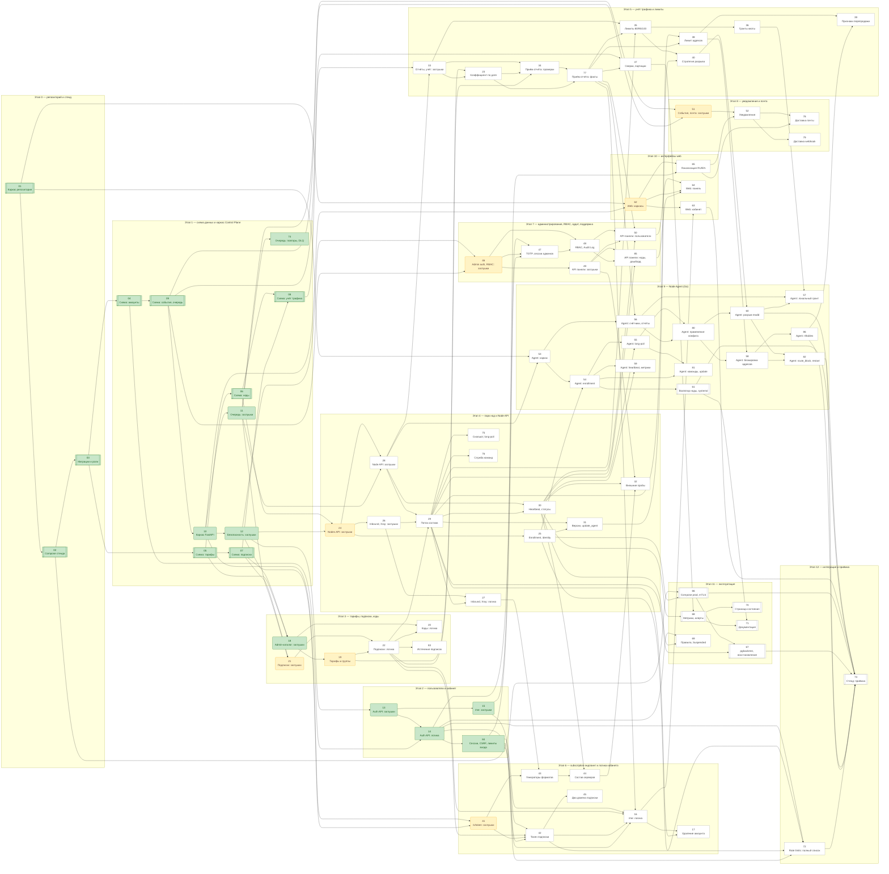

# План разработки: Control Plane для распределённой VPN-инфраструктуры (Task 001)

Источник требований: `docs/TASK.md` (Task 001 `vpn-control-plane-mvp`). Архитектура:
`docs/ARCHITECTURE.md` и `docs/architectures/*.md`. Постановка: `docs/idea.md`.

Метод: Stub-First. Каждая внешняя поверхность (маршрут, контракт, интерфейс агента) и каждый
модуль проходят задачу `[STUB CREATION]` (структура, сигнатуры, сквозной тест на фиксированных
значениях) до задачи `[LOGIC IMPLEMENTATION]` (замена заглушек, модульные тесты). Конфигурационные
задачи помечены `[CONFIGURATION]` и пары не имеют (`planning-decision-tree` §1).

Всего задач: 86, суммарная оценка 291 ч. Файлы задач: `docs/tasks/task-001-NN-slug.md`.
Номер задачи `001.NN` — идентификатор, а не порядок. В таблицах ниже он сокращён до `NN`.

Порядок исполнения задаётся графом зависимостей: задача начинается, когда приняты все её
зависимости. Этап — метка области, а не барьер; внутри этапа задачи перечислены в порядке,
допустимом графом. Граф ацикличен и замкнут (каждая зависимость — задача плана); это проверяет
`docs/scripts/plan_graph.py`, он же собирает раздел «Состояние выполнения и граф зависимостей».

Сквозной срез §7.2 постановки собирается из задач этапов 0–6 и 9 и проверяется на стенде задачей
001.73.

## Состояние выполнения и граф зависимостей

Статус задачи — строка `Статус:` её записи ниже: `принята — коммит <hash> (<дата>)`,
`в работе (с <дата>)` или `не начата`. «Готова к началу» руками не пишется — выводится из графа.

<!-- generated:plan-status start -->

Состояние на 2026-09-10: принято 18 задач из 86 (60 ч из 291 ч), в работе 0, готовы к началу 7. Блок
собран скриптом `docs/scripts/plan_graph.py` из строк `Статус:` и `Зависимости:` записей задач;
после приёмки задачи обновите её строку `Статус:` и выполните `python3 docs/scripts/plan_graph.py
--write`.

| Этап | Задач | Часов | Принято | Часов принято | В работе | Готовы к началу |
| :--- | ---: | ---: | ---: | ---: | ---: | :--- |
| Этап 0 — репозиторий и стенд | 3 | 10 | 3 | 10 | 0 | — |
| Этап 1 — схема данных и каркас Control Plane | 10 | 33 | 10 | 33 | 0 | — |
| Этап 2 — пользователи и кабинет | 4 | 14 | 4 | 14 | 0 | — |
| Этап 3 — тарифы, подписки, коды | 6 | 19 | 1 | 3 | 0 | 19, 21 |
| Этап 4 — парк нод и Node API | 11 | 38 | 0 | 0 | 0 | 24 |
| Этап 5 — учёт трафика и лимиты | 10 | 32 | 0 | 0 | 0 | — |
| Этап 6 — subscription-эндпоинт и логика кабинета | 7 | 22 | 0 | 0 | 0 | 41 |
| Этап 7 — администрирование, RBAC, аудит, поддержка | 6 | 22 | 0 | 0 | 0 | 46 |
| Этап 8 — уведомления и почта | 4 | 11 | 0 | 0 | 0 | 51 |
| Этап 9 — Node Agent (Go) | 13 | 47 | 0 | 0 | 0 | — |
| Этап 10 — интерфейсы web | 4 | 15 | 0 | 0 | 0 | 62 |
| Этап 11 — эксплуатация | 6 | 21 | 0 | 0 | 0 | — |
| Этап 12 — интеграция и приёмка | 2 | 7 | 0 | 0 | 0 | — |
| **Итого** | 86 | 291 | 18 | 60 | 0 | 19, 21, 24, 41, 46, 51, 62 |

Готовы к началу (все зависимости приняты; порядок — приоритет, затем номер):

- **001.21** — Служба подписок: интерфейс состояния, периодов и переходов — заглушки (заглушки,
  Critical, 2 ч)
- **001.24** — API нод и enrollment: маршруты, bootstrap-токен, заглушки (заглушки, Critical, 3 ч) —
  на критическом пути
- **001.41** — Subscription-эндпоинт `/s/{token}`: маршруты, генераторы, страница — заглушки
  (заглушки, Critical, 3 ч)
- **001.46** — Аутентификация администраторов, RBAC и аудит — интерфейсы и заглушки (заглушки,
  Critical, 3 ч)
- **001.19** — Тарифы и группы: логика, одна тарифицируемая группа, история коэффициентов (логика,
  High, 4 ч)
- **001.51** — События, почта, webhook — интерфейсы и заглушки (заглушки, High, 2 ч)
- **001.62** — Web: клиент API из OpenAPI, пакет локализации, каркасы кабинета и панели (заглушки,
  High, 4 ч)

Критический путь до задачи 001.73 — 62 ч по оценкам, 7 из 18 задач приняты: 01 → 02 → 03 → 04 → 09 →
10 → 12 → 24 → 28 → 33 → 23 → 34 → 77 → 56 → 80 → 58 → 86 → 73.

Диаграмма: узел — задача `NN`; форма — тип (двойная рамка — конфигурация, скруглённая — заглушки,
прямоугольник — логика); заливка — состояние (зелёная — принята, синяя — в работе, жёлтая — готова к
началу, без заливки — ждёт зависимостей); стрелка — «нужна для». Полные названия — в разделе
«Последовательность выполнения задач».

<!-- generated:plan-status end -->

<!-- contract:sequence -->

## Последовательность выполнения задач

### Этап 0 — репозиторий и стенд — 10 ч

- **Задача 001.01** — Каркас монорепозитория и инструменты проверки [CONFIGURATION]
  - Сценарии: UC-01, UC-16
  - Требования: R-01, R-42, R-50
  - Файл описания: `docs/tasks/task-001-01-repo-skeleton.md`
  - Приоритет: Critical
  - Оценка: 3 ч
  - Зависимости: нет
  - Статус: принята — коммит 1d0db00 (2026-09-08)

- **Задача 001.02** — Docker Compose для разработки и стенда [CONFIGURATION]
  - Сценарии: UC-10, UC-01
  - Требования: R-42
  - Файл описания: `docs/tasks/task-001-02-compose-dev-stand.md`
  - Приоритет: Critical
  - Оценка: 4 ч
  - Зависимости: Задача 001.01
  - Статус: принята — коммит 19bae33 (2026-09-08)

- **Задача 001.03** — Инструмент миграций, расширения, роли и перечисления базы [CONFIGURATION]
  - Сценарии: UC-10
  - Требования: R-42, R-44
  - Файл описания: `docs/tasks/task-001-03-migrations-tooling.md`
  - Приоритет: Critical
  - Оценка: 3 ч
  - Зависимости: Задача 001.02
  - Статус: принята — коммит c5b0553 (2026-09-08)

### Этап 1 — схема данных и каркас Control Plane — 33 ч

- **Задача 001.04** — Схема: учётные записи и аутентификация [CONFIGURATION]
  - Сценарии: UC-02, UC-15, UC-14
  - Требования: R-01, R-08, R-09, R-13, R-36
  - Файл описания: `docs/tasks/task-001-04-schema-identity.md`
  - Приоритет: Critical
  - Оценка: 3 ч
  - Зависимости: Задача 001.03
  - Статус: принята — коммит eb2842c (2026-09-08)

- **Задача 001.05** — Схема: тарифы, группы, коэффициенты [CONFIGURATION]
  - Сценарии: UC-09
  - Требования: R-01, R-18, R-23, R-30
  - Файл описания: `docs/tasks/task-001-05-schema-catalog.md`
  - Приоритет: Critical
  - Оценка: 3 ч
  - Зависимости: Задача 001.03
  - Статус: принята — коммит 0414383 (2026-09-08)

- **Задача 001.06** — Схема: парк нод, inbound, состояние и команды [CONFIGURATION]
  - Сценарии: UC-01, UC-07, UC-11, UC-12
  - Требования: R-01, R-02, R-03, R-04, R-05, R-06, R-07
  - Файл описания: `docs/tasks/task-001-06-schema-nodes.md`
  - Приоритет: Critical
  - Оценка: 4 ч
  - Зависимости: Задача 001.05
  - Статус: принята — коммит 0f8ae04 (2026-09-08)

- **Задача 001.07** — Схема: подписки, баланс, токены, коды [CONFIGURATION]
  - Сценарии: UC-02, UC-06, UC-16
  - Требования: R-01, R-14, R-31, R-32, R-33
  - Файл описания: `docs/tasks/task-001-07-schema-subscriptions.md`
  - Приоритет: Critical
  - Оценка: 3 ч
  - Зависимости: Задача 001.05
  - Статус: принята — коммит deeb87a (2026-09-08)

- **Задача 001.08** — Схема: учёт трафика, гранты, адреса, функции обслуживания партиций [CONFIGURATION]
  - Сценарии: UC-04, UC-05, UC-08
  - Требования: R-01, R-19, R-20, R-21, R-22, R-26, R-27
  - Файл описания: `docs/tasks/task-001-08-schema-accounting.md`
  - Приоритет: Critical
  - Оценка: 4 ч
  - Зависимости: Задача 001.06, Задача 001.07
  - Статус: принята — коммит fc266b1 (2026-09-09)

- **Задача 001.09** — Схема: события, доставки, очередь задач, аудит, настройки [CONFIGURATION]
  - Сценарии: UC-13, UC-05
  - Требования: R-01, R-37, R-39, R-40, R-46, R-48
  - Файл описания: `docs/tasks/task-001-09-schema-ops.md`
  - Приоритет: Critical
  - Оценка: 3 ч
  - Зависимости: Задача 001.04
  - Статус: принята — коммит 48717a1 (2026-09-09)

- **Задача 001.10** — Каркас FastAPI: конфигурация, пул, Redis, формат ошибок, OpenAPI [STUB CREATION]
  - Сценарии: UC-03, UC-16
  - Требования: R-01, R-50, R-51
  - Файл описания: `docs/tasks/task-001-10-api-skeleton.md`
  - Приоритет: Critical
  - Оценка: 4 ч
  - Зависимости: Задача 001.09
  - Статус: принята — коммит a207198 (2026-09-09)

- **Задача 001.11** — Очередь задач в PostgreSQL: интерфейс и каркас исполнителей [STUB CREATION]
  - Сценарии: UC-05, UC-04
  - Требования: R-46
  - Файл описания: `docs/tasks/task-001-11-jobs-queue-stub.md`
  - Приоритет: Critical
  - Оценка: 3 ч
  - Зависимости: Задача 001.10
  - Статус: принята — коммит 638fb4f (2026-09-09)

- **Задача 001.12** — Ядро безопасности: интерфейсы паролей, сессий, CSRF, лимитов, шифрования [STUB CREATION]
  - Сценарии: UC-02, UC-15, UC-16
  - Требования: R-36, R-44, R-45
  - Файл описания: `docs/tasks/task-001-12-security-core-stub.md`
  - Приоритет: Critical
  - Оценка: 3 ч
  - Зависимости: Задача 001.10
  - Статус: принята — коммит 6338bf6 (2026-09-09)

- **Задача 001.74** — Очередь задач: повторы, экспоненциальная задержка, DLQ с алертом, бюджет ожидания [LOGIC IMPLEMENTATION]
  - Сценарии: UC-05, UC-04
  - Требования: R-46
  - Файл описания: `docs/tasks/task-001-74-jobs-queue-logic.md`
  - Приоритет: Critical
  - Оценка: 3 ч
  - Зависимости: Задача 001.11
  - Статус: принята — коммит ba16191 (2026-09-09)

### Этап 2 — пользователи и кабинет — 14 ч

- **Задача 001.13** — API аутентификации пользователей: маршруты и сквозные тесты на заглушках [STUB CREATION]
  - Сценарии: UC-02, UC-15
  - Требования: R-08, R-09
  - Файл описания: `docs/tasks/task-001-13-auth-api-stub.md`
  - Приоритет: High
  - Оценка: 3 ч
  - Зависимости: Задача 001.12
  - Статус: принята — коммит 27577d9 (2026-09-09)

- **Задача 001.14** — API аутентификации: регистрация, подтверждение адреса, восстановление пароля [LOGIC IMPLEMENTATION]
  - Сценарии: UC-02, UC-15
  - Требования: R-08, R-09
  - Файл описания: `docs/tasks/task-001-14-auth-api-logic.md`
  - Приоритет: High
  - Оценка: 4 ч
  - Зависимости: Задача 001.13, Задача 001.04
  - Статус: принята — коммит d162aab (2026-09-09)

- **Задача 001.15** — API кабинета `/api/v1/me`: маршруты и сквозные тесты на заглушках [STUB CREATION]
  - Сценарии: UC-16, UC-14
  - Требования: R-10, R-11, R-12, R-13, R-52
  - Файл описания: `docs/tasks/task-001-15-me-api-stub.md`
  - Приоритет: High
  - Оценка: 3 ч
  - Зависимости: Задача 001.13
  - Статус: принята — коммит c5fd09b (2026-09-09)

- **Задача 001.84** — Сессии в Redis, CSRF, вход и ограничения частоты входа [LOGIC IMPLEMENTATION]
  - Сценарии: UC-02, UC-16
  - Требования: R-08, R-45
  - Файл описания: `docs/tasks/task-001-84-sessions-csrf-login-limits-logic.md`
  - Приоритет: High
  - Оценка: 4 ч
  - Зависимости: Задача 001.14
  - Статус: принята — закрыта как выполненная в 001.14, коммит 1018eba (2026-09-09)

### Этап 3 — тарифы, подписки, коды — 19 ч

- **Задача 001.18** — API администратора: тарифы, группы, коды — маршруты и заглушки [STUB CREATION]
  - Сценарии: UC-09
  - Требования: R-18, R-30, R-32, R-33
  - Файл описания: `docs/tasks/task-001-18-catalog-api-stub.md`
  - Приоритет: High
  - Оценка: 3 ч
  - Зависимости: Задача 001.12, Задача 001.05
  - Статус: принята — коммит 0835261 (2026-09-10)

- **Задача 001.19** — Тарифы и группы: логика, одна тарифицируемая группа, история коэффициентов [LOGIC IMPLEMENTATION]
  - Сценарии: UC-09
  - Требования: R-18, R-30
  - Файл описания: `docs/tasks/task-001-19-plans-groups-logic.md`
  - Приоритет: High
  - Оценка: 4 ч
  - Зависимости: Задача 001.18
  - Статус: не начата

- **Задача 001.21** — Служба подписок: интерфейс состояния, периодов и переходов — заглушки [STUB CREATION]
  - Сценарии: UC-02, UC-05, UC-06
  - Требования: R-24, R-31
  - Файл описания: `docs/tasks/task-001-21-subscription-service-stub.md`
  - Приоритет: Critical
  - Оценка: 2 ч
  - Зависимости: Задача 001.07, Задача 001.11
  - Статус: не начата

- **Задача 001.22** — Служба подписок: активация, продление, смена тарифа, начисление трафика [LOGIC IMPLEMENTATION]
  - Сценарии: UC-02, UC-06, UC-05
  - Требования: R-24, R-31
  - Файл описания: `docs/tasks/task-001-22-subscription-service-logic.md`
  - Приоритет: Critical
  - Оценка: 4 ч
  - Зависимости: Задача 001.21, Задача 001.19
  - Статус: не начата

- **Задача 001.20** — Redeem- и Promo-коды: генерация, экспорт, активация, учёт использования [LOGIC IMPLEMENTATION]
  - Сценарии: UC-02, UC-09
  - Требования: R-32, R-33
  - Файл описания: `docs/tasks/task-001-20-codes-logic.md`
  - Приоритет: High
  - Оценка: 4 ч
  - Зависимости: Задача 001.18, Задача 001.22
  - Статус: не начата

- **Задача 001.83** — Служба подписок: истечение по расписанию и уведомление «истекает» [LOGIC IMPLEMENTATION]
  - Сценарии: UC-06
  - Требования: R-24, R-31
  - Файл описания: `docs/tasks/task-001-83-subscription-expiry-scheduler-logic.md`
  - Приоритет: High
  - Оценка: 2 ч
  - Зависимости: Задача 001.22
  - Статус: не начата

### Этап 4 — парк нод и Node API — 38 ч

- **Задача 001.24** — API нод и enrollment: маршруты, bootstrap-токен, заглушки [STUB CREATION]
  - Сценарии: UC-01, UC-12
  - Требования: R-02
  - Файл описания: `docs/tasks/task-001-24-nodes-api-stub.md`
  - Приоритет: Critical
  - Оценка: 3 ч
  - Зависимости: Задача 001.06, Задача 001.12
  - Статус: не начата

- **Задача 001.25** — Enrollment и identity ноды: внутренний CA, bootstrap-токен, подтверждение, отзыв [LOGIC IMPLEMENTATION]
  - Сценарии: UC-01, UC-12
  - Требования: R-02, R-44
  - Файл описания: `docs/tasks/task-001-25-enrollment-identity-logic.md`
  - Приоритет: Critical
  - Оценка: 4 ч
  - Зависимости: Задача 001.24
  - Статус: не начата

- **Задача 001.26** — Inbound и генератор конфигурации Xray: модель, ключи REALITY, заглушки [STUB CREATION]
  - Сценарии: UC-01, UC-03
  - Требования: R-03
  - Файл описания: `docs/tasks/task-001-26-inbound-xray-config-stub.md`
  - Приоритет: Critical
  - Оценка: 3 ч
  - Зависимости: Задача 001.24
  - Статус: не начата

- **Задача 001.28** — Node API: состояние (long-poll), подтверждение, heartbeat, команды — заглушки [STUB CREATION]
  - Сценарии: UC-01, UC-07, UC-11
  - Требования: R-04, R-05, R-07
  - Файл описания: `docs/tasks/task-001-28-agent-state-api-stub.md`
  - Приоритет: Critical
  - Оценка: 3 ч
  - Зависимости: Задача 001.24, Задача 001.11
  - Статус: не начата

- **Задача 001.29** — Поток состава: `updated_seq`, вентиль по статусу, `resync_required` [LOGIC IMPLEMENTATION]
  - Сценарии: UC-01, UC-05, UC-10, UC-11
  - Требования: R-04
  - Файл описания: `docs/tasks/task-001-29-composition-stream-logic.md`
  - Приоритет: Critical
  - Оценка: 4 ч
  - Зависимости: Задача 001.28, Задача 001.22, Задача 001.26
  - Статус: не начата

- **Задача 001.27** — Inbound: генерация конфигурации Xray, ротация ключей, проверка цели [LOGIC IMPLEMENTATION]
  - Сценарии: UC-01, UC-12
  - Требования: R-03
  - Файл описания: `docs/tasks/task-001-27-inbound-xray-config-logic.md`
  - Приоритет: Critical
  - Оценка: 4 ч
  - Зависимости: Задача 001.26, Задача 001.29
  - Статус: не начата

- **Задача 001.30** — Heartbeat, статусы ноды, пороги Н-15, матрица влияния, метрики [LOGIC IMPLEMENTATION]
  - Сценарии: UC-07, UC-01
  - Требования: R-05
  - Файл описания: `docs/tasks/task-001-30-heartbeat-statuses-logic.md`
  - Приоритет: High
  - Оценка: 4 ч
  - Зависимости: Задача 001.28, Задача 001.29
  - Статус: не начата

- **Задача 001.31** — Закреплённые версии, команда `update_agent`, ротация identity с перекрытием [LOGIC IMPLEMENTATION]
  - Сценарии: UC-11, UC-12
  - Требования: R-07, R-44
  - Файл описания: `docs/tasks/task-001-31-versions-update-command-logic.md`
  - Приоритет: Medium
  - Оценка: 3 ч
  - Зависимости: Задача 001.29, Задача 001.25
  - Статус: не начата

- **Задача 001.32** — Внешние пробы доступности нод по странам (приоритет S) [LOGIC IMPLEMENTATION]
  - Сценарии: UC-07
  - Требования: R-06
  - Файл описания: `docs/tasks/task-001-32-country-probes-logic.md`
  - Приоритет: Medium
  - Оценка: 3 ч
  - Зависимости: Задача 001.30, Задача 001.44, Задача 001.49
  - Статус: не начата

- **Задача 001.75** — Поток состава: полный снапшот, `state_generation`, long-poll, подтверждение [LOGIC IMPLEMENTATION]
  - Сценарии: UC-01, UC-10
  - Требования: R-04
  - Файл описания: `docs/tasks/task-001-75-composition-snapshot-generation-longpoll-logic.md`
  - Приоритет: Critical
  - Оценка: 4 ч
  - Зависимости: Задача 001.29
  - Статус: не начата

- **Задача 001.76** — Служба команд: выдача в ответе состояния, идемпотентность, TTL, статусы [LOGIC IMPLEMENTATION]
  - Сценарии: UC-11, UC-12
  - Требования: R-04
  - Файл описания: `docs/tasks/task-001-76-commands-service-logic.md`
  - Приоритет: High
  - Оценка: 3 ч
  - Зависимости: Задача 001.29
  - Статус: не начата

### Этап 5 — учёт трафика и лимиты — 32 ч

- **Задача 001.33** — Node API отчётов, модули учёта и лимитов — сигнатуры и заглушки [STUB CREATION]
  - Сценарии: UC-04
  - Требования: R-19, R-21, R-22, R-23, R-24, R-26, R-27, R-29, R-48
  - Файл описания: `docs/tasks/task-001-33-reports-api-stub.md`
  - Приоритет: Critical
  - Оценка: 4 ч
  - Зависимости: Задача 001.28, Задача 001.08
  - Статус: не начата

- **Задача 001.23** — Разрешение коэффициента трафика по дате: нода → группа → 1.0 [LOGIC IMPLEMENTATION]
  - Сценарии: UC-04, UC-09
  - Требования: R-23
  - Файл описания: `docs/tasks/task-001-23-multiplier-resolution-logic.md`
  - Приоритет: Critical
  - Оценка: 2 ч
  - Зависимости: Задача 001.19, Задача 001.33
  - Статус: не начата

- **Задача 001.34** — Приём отчёта: идемпотентность, допуск времени, порог аномалии [LOGIC IMPLEMENTATION]
  - Сценарии: UC-04
  - Требования: R-19, R-21, R-22
  - Файл описания: `docs/tasks/task-001-34-report-acceptance-logic.md`
  - Приоритет: Critical
  - Оценка: 4 ч
  - Зависимости: Задача 001.33, Задача 001.23, Задача 001.22
  - Статус: не начата

- **Задача 001.77** — Приём отчёта: факты, накопление часа, баланс, поздний отчёт, `close_hour` [LOGIC IMPLEMENTATION]
  - Сценарии: UC-04
  - Требования: R-19, R-21, R-22
  - Файл описания: `docs/tasks/task-001-77-report-lines-hourly-balance-logic.md`
  - Приоритет: Critical
  - Оценка: 4 ч
  - Зависимости: Задача 001.34, Задача 001.23
  - Статус: не начата

- **Задача 001.35** — Лимиты и пороги 80/95/100 %: `suspended_quota`, отзыв и восстановление [LOGIC IMPLEMENTATION]
  - Сценарии: UC-05
  - Требования: R-24
  - Файл описания: `docs/tasks/task-001-35-limits-thresholds-logic.md`
  - Приоритет: Critical
  - Оценка: 4 ч
  - Зависимости: Задача 001.29, Задача 001.33, Задача 001.77
  - Статус: не начата

- **Задача 001.36** — Гранты квоты: выдача, замена, учёт расхода, ограничение Н-17 [LOGIC IMPLEMENTATION]
  - Сценарии: UC-05
  - Требования: R-26
  - Файл описания: `docs/tasks/task-001-36-quota-grants-logic.md`
  - Приоритет: High
  - Оценка: 3 ч
  - Зависимости: Задача 001.35
  - Статус: не начата

- **Задача 001.37** — Сверки, суточная агрегация, партиции и сроки хранения [LOGIC IMPLEMENTATION]
  - Сценарии: UC-04, UC-10
  - Требования: R-21, R-22, R-48
  - Файл описания: `docs/tasks/task-001-37-reconciliation-aggregation-retention-logic.md`
  - Приоритет: High
  - Оценка: 4 ч
  - Зависимости: Задача 001.09, Задача 001.77
  - Статус: не начата

- **Задача 001.38** — Лимит уникальных адресов: подсчёт, `blocked_ips`, вытеснение [LOGIC IMPLEMENTATION]
  - Сценарии: UC-08
  - Требования: R-27
  - Файл описания: `docs/tasks/task-001-38-device-limit-logic.md`
  - Приоритет: High
  - Оценка: 3 ч
  - Зависимости: Задача 001.29, Задача 001.77
  - Статус: не начата

- **Задача 001.39** — Признаки перепродажи доступа в карточке пользователя (приоритет S) [LOGIC IMPLEMENTATION]
  - Сценарии: UC-08
  - Требования: R-29
  - Файл описания: `docs/tasks/task-001-39-resale-signals-logic.md`
  - Приоритет: Medium
  - Оценка: 2 ч
  - Зависимости: Задача 001.38, Задача 001.86
  - Статус: не начата

- **Задача 001.40** — Стратегия принудительного разрыва: выбор кандидата, указание ноде [LOGIC IMPLEMENTATION]
  - Сценарии: UC-05
  - Требования: R-25
  - Файл описания: `docs/tasks/task-001-40-force-disconnect-strategy-logic.md`
  - Приоритет: High
  - Оценка: 2 ч
  - Зависимости: Задача 001.35, Задача 001.31
  - Статус: не начата

### Этап 6 — subscription-эндпоинт и логика кабинета — 22 ч

- **Задача 001.41** — Subscription-эндпоинт `/s/{token}`: маршруты, генераторы, страница — заглушки [STUB CREATION]
  - Сценарии: UC-03
  - Требования: R-14, R-15, R-16, R-17
  - Файл описания: `docs/tasks/task-001-41-subscription-endpoint-stub.md`
  - Приоритет: Critical
  - Оценка: 3 ч
  - Зависимости: Задача 001.10, Задача 001.07
  - Статус: не начата

- **Задача 001.42** — Токен подписки, выбор формата, заголовки, состояния, журнал обращений, лимиты [LOGIC IMPLEMENTATION]
  - Сценарии: UC-03, UC-16
  - Требования: R-14
  - Файл описания: `docs/tasks/task-001-42-subscription-token-format-logic.md`
  - Приоритет: Critical
  - Оценка: 4 ч
  - Зависимости: Задача 001.14, Задача 001.22, Задача 001.41, Задача 001.84
  - Статус: не начата

- **Задача 001.16** — API кабинета: логика профиля, статистики, перевыпуска токена, онбординга [LOGIC IMPLEMENTATION]
  - Сценарии: UC-16
  - Требования: R-10, R-11, R-12, R-52
  - Файл описания: `docs/tasks/task-001-16-me-api-logic.md`
  - Приоритет: High
  - Оценка: 4 ч
  - Зависимости: Задача 001.15, Задача 001.22, Задача 001.42, Задача 001.77, Задача 001.84
  - Статус: не начата

- **Задача 001.17** — Удаление аккаунта: стирание PII, отзыв credentials, аннулирование токена [LOGIC IMPLEMENTATION]
  - Сценарии: UC-14
  - Требования: R-13
  - Файл описания: `docs/tasks/task-001-17-account-deletion-logic.md`
  - Приоритет: Medium
  - Оценка: 2 ч
  - Зависимости: Задача 001.16, Задача 001.29
  - Статус: не начата

- **Задача 001.43** — Генераторы `base64` и `singbox`: матрица «профиль × формат», golden-файлы [LOGIC IMPLEMENTATION]
  - Сценарии: UC-03
  - Требования: R-15
  - Файл описания: `docs/tasks/task-001-43-subscription-generators-logic.md`
  - Приоритет: Critical
  - Оценка: 4 ч
  - Зависимости: Задача 001.41, Задача 001.27
  - Статус: не начата

- **Задача 001.44** — Динамический состав серверов: фильтры, статусы, страны, `users_seq` [LOGIC IMPLEMENTATION]
  - Сценарии: UC-03, UC-07, UC-06
  - Требования: R-16
  - Файл описания: `docs/tasks/task-001-44-subscription-composer-logic.md`
  - Приоритет: High
  - Оценка: 3 ч
  - Зависимости: Задача 001.43, Задача 001.30
  - Статус: не начата

- **Задача 001.45** — Два домена подписки и страница подписки [LOGIC IMPLEMENTATION]
  - Сценарии: UC-03, UC-16
  - Требования: R-17
  - Файл описания: `docs/tasks/task-001-45-subscription-domains-page-logic.md`
  - Приоритет: High
  - Оценка: 2 ч
  - Зависимости: Задача 001.42
  - Статус: не начата

### Этап 7 — администрирование, RBAC, аудит, поддержка — 22 ч

- **Задача 001.46** — Аутентификация администраторов, RBAC и аудит — интерфейсы и заглушки [STUB CREATION]
  - Сценарии: UC-09, UC-13
  - Требования: R-35, R-36, R-37
  - Файл описания: `docs/tasks/task-001-46-admin-auth-rbac-audit-stub.md`
  - Приоритет: Critical
  - Оценка: 3 ч
  - Зависимости: Задача 001.12, Задача 001.09
  - Статус: не начата

- **Задача 001.47** — Аутентификация администраторов: TOTP, резервные коды, сессии [LOGIC IMPLEMENTATION]
  - Сценарии: UC-09
  - Требования: R-36
  - Файл описания: `docs/tasks/task-001-47-admin-auth-2fa-logic.md`
  - Приоритет: Critical
  - Оценка: 4 ч
  - Зависимости: Задача 001.14, Задача 001.46, Задача 001.84
  - Статус: не начата

- **Задача 001.48** — RBAC: матрица и политики §5.11; Audit Log append-only [LOGIC IMPLEMENTATION]
  - Сценарии: UC-09, UC-13
  - Требования: R-35, R-37
  - Файл описания: `docs/tasks/task-001-48-rbac-audit-logic.md`
  - Приоритет: Critical
  - Оценка: 4 ч
  - Зависимости: Задача 001.46, Задача 001.47
  - Статус: не начата

- **Задача 001.49** — API панели: пользователи, ноды, дашборд, настройки, данные поддержки — заглушки [STUB CREATION]
  - Сценарии: UC-13, UC-09
  - Требования: R-06, R-34, R-38
  - Файл описания: `docs/tasks/task-001-49-admin-users-nodes-dashboard-stub.md`
  - Приоритет: High
  - Оценка: 3 ч
  - Зависимости: Задача 001.46
  - Статус: не начата

- **Задача 001.50** — API панели: пользователи, карточка с данными поддержки, действия [LOGIC IMPLEMENTATION]
  - Сценарии: UC-13, UC-09, UC-07
  - Требования: R-34, R-38
  - Файл описания: `docs/tasks/task-001-50-admin-users-nodes-dashboard-logic.md`
  - Приоритет: High
  - Оценка: 4 ч
  - Зависимости: Задача 001.30, Задача 001.48, Задача 001.49, Задача 001.77
  - Статус: не начата

- **Задача 001.85** — API панели: карточка ноды с метриками, дашборд, настройки [LOGIC IMPLEMENTATION]
  - Сценарии: UC-07, UC-09
  - Требования: R-34
  - Файл описания: `docs/tasks/task-001-85-admin-nodes-dashboard-settings-logic.md`
  - Приоритет: High
  - Оценка: 4 ч
  - Зависимости: Задача 001.49, Задача 001.30, Задача 001.48
  - Статус: не начата

### Этап 8 — уведомления и почта — 11 ч

- **Задача 001.51** — События, почта, webhook — интерфейсы и заглушки [STUB CREATION]
  - Сценарии: UC-05, UC-07, UC-02
  - Требования: R-39, R-40, R-41
  - Файл описания: `docs/tasks/task-001-51-notifications-stub.md`
  - Приоритет: High
  - Оценка: 2 ч
  - Зависимости: Задача 001.11, Задача 001.09
  - Статус: не начата

- **Задача 001.52** — Уведомления: события, подавление повторов, язык получателя [LOGIC IMPLEMENTATION]
  - Сценарии: UC-05, UC-07, UC-15
  - Требования: R-39, R-40
  - Файл описания: `docs/tasks/task-001-52-notifications-logic.md`
  - Приоритет: High
  - Оценка: 3 ч
  - Зависимости: Задача 001.51, Задача 001.65
  - Статус: не начата

- **Задача 001.78** — Доставка почты: SMTP-реле, шаблоны на двух языках, отказы, показатель доставки [LOGIC IMPLEMENTATION]
  - Сценарии: UC-15, UC-02
  - Требования: R-39, R-41
  - Файл описания: `docs/tasks/task-001-78-email-delivery-logic.md`
  - Приоритет: High
  - Оценка: 3 ч
  - Зависимости: Задача 001.52, Задача 001.65
  - Статус: не начата

- **Задача 001.79** — Доставка webhook: подпись HMAC, повторы, идентификатор события, защита от SSRF [LOGIC IMPLEMENTATION]
  - Сценарии: UC-07, UC-05
  - Требования: R-39, R-40
  - Файл описания: `docs/tasks/task-001-79-webhook-delivery-logic.md`
  - Приоритет: High
  - Оценка: 3 ч
  - Зависимости: Задача 001.52
  - Статус: не начата

### Этап 9 — Node Agent (Go) — 47 ч

- **Задача 001.53** — Node Agent: каркас, конфигурация, клиенты, хранилище — интерфейсы [STUB CREATION]
  - Сценарии: UC-01, UC-04
  - Требования: R-02, R-04, R-05, R-19, R-20, R-25, R-26, R-27, R-28
  - Файл описания: `docs/tasks/task-001-53-agent-skeleton-stub.md`
  - Приоритет: Critical
  - Оценка: 4 ч
  - Зависимости: Задача 001.01, Задача 001.28
  - Статус: не начата

- **Задача 001.54** — Node Agent: enrollment, хранение identity, mTLS-клиент, повторное подтверждение [LOGIC IMPLEMENTATION]
  - Сценарии: UC-01, UC-10
  - Требования: R-02
  - Файл описания: `docs/tasks/task-001-54-agent-enroll-mtls-logic.md`
  - Приоритет: Critical
  - Оценка: 4 ч
  - Зависимости: Задача 001.53, Задача 001.25
  - Статус: не начата

- **Задача 001.55** — Node Agent: цикл long-poll, курсоры, снапшот, `resync_required`, `state_generation` [LOGIC IMPLEMENTATION]
  - Сценарии: UC-01, UC-05, UC-11
  - Требования: R-04
  - Файл описания: `docs/tasks/task-001-55-agent-sync-apply-logic.md`
  - Приоритет: Critical
  - Оценка: 4 ч
  - Зависимости: Задача 001.54, Задача 001.29
  - Статус: не начата

- **Задача 001.56** — Node Agent: счётчики, эпохи, буфер SQLite, отчёты, синхронизация времени [LOGIC IMPLEMENTATION]
  - Сценарии: UC-04
  - Требования: R-19, R-20
  - Файл описания: `docs/tasks/task-001-56-agent-accounting-logic.md`
  - Приоритет: Critical
  - Оценка: 4 ч
  - Зависимости: Задача 001.53, Задача 001.77
  - Статус: не начата

- **Задача 001.80** — Node Agent: применение конфигурации с перезапуском и горячее применение состава [LOGIC IMPLEMENTATION]
  - Сценарии: UC-01, UC-05
  - Требования: R-04
  - Файл описания: `docs/tasks/task-001-80-agent-apply-config-users-logic.md`
  - Приоритет: Critical
  - Оценка: 4 ч
  - Зависимости: Задача 001.55, Задача 001.56
  - Статус: не начата

- **Задача 001.60** — Node Agent: стратегия разрыва `readd` (значение по умолчанию) [LOGIC IMPLEMENTATION]
  - Сценарии: UC-05
  - Требования: R-25
  - Файл описания: `docs/tasks/task-001-60-agent-disconnect-logic.md`
  - Приоритет: High
  - Оценка: 3 ч
  - Зависимости: Задача 001.40, Задача 001.80
  - Статус: не начата

- **Задача 001.57** — Node Agent: локальный грант квоты и автономное отключение [LOGIC IMPLEMENTATION]
  - Сценарии: UC-05
  - Требования: R-26
  - Файл описания: `docs/tasks/task-001-57-agent-quota-logic.md`
  - Приоритет: High
  - Оценка: 3 ч
  - Зависимости: Задача 001.36, Задача 001.56, Задача 001.60
  - Статус: не начата

- **Задача 001.58** — Node Agent: блокировка адресов через RoutingService с переустановкой [LOGIC IMPLEMENTATION]
  - Сценарии: UC-08
  - Требования: R-27
  - Файл описания: `docs/tasks/task-001-58-agent-guard-logic.md`
  - Приоритет: High
  - Оценка: 3 ч
  - Зависимости: Задача 001.38, Задача 001.80
  - Статус: не начата

- **Задача 001.59** — Node Agent: heartbeat, метрики ОС и Xray, экспорт для Control Plane [LOGIC IMPLEMENTATION]
  - Сценарии: UC-07
  - Требования: R-05
  - Файл описания: `docs/tasks/task-001-59-agent-metrics-heartbeat-logic.md`
  - Приоритет: High
  - Оценка: 3 ч
  - Зависимости: Задача 001.30, Задача 001.54
  - Статус: не начата

- **Задача 001.61** — Bootstrap ноды, systemd-юниты, nftables, закреплённая версия Xray [CONFIGURATION]
  - Сценарии: UC-01
  - Требования: R-02, R-28, R-42
  - Файл описания: `docs/tasks/task-001-61-node-bootstrap-systemd-nftables.md`
  - Приоритет: Critical
  - Оценка: 4 ч
  - Зависимости: Задача 001.54
  - Статус: не начата

- **Задача 001.81** — Node Agent: исполнение команд и `update_agent` с откатом [LOGIC IMPLEMENTATION]
  - Сценарии: UC-11, UC-12
  - Требования: R-04, R-07
  - Файл описания: `docs/tasks/task-001-81-agent-commands-update-logic.md`
  - Приоритет: High
  - Оценка: 4 ч
  - Зависимости: Задача 001.55, Задача 001.54
  - Статус: не начата

- **Задача 001.82** — Node Agent: стратегии разрыва `route_block` и `restart_inbound` [LOGIC IMPLEMENTATION]
  - Сценарии: UC-05
  - Требования: R-25
  - Файл описания: `docs/tasks/task-001-82-agent-disconnect-alt-strategies-logic.md`
  - Приоритет: High
  - Оценка: 3 ч
  - Зависимости: Задача 001.60, Задача 001.58
  - Статус: не начата

- **Задача 001.86** — Node Agent: nftables — лимит соединений с адреса, egress-фильтры, conntrack [LOGIC IMPLEMENTATION]
  - Сценарии: UC-08
  - Требования: R-28, R-29
  - Файл описания: `docs/tasks/task-001-86-agent-nftables-egress-conntrack-logic.md`
  - Приоритет: High
  - Оценка: 4 ч
  - Зависимости: Задача 001.58
  - Статус: не начата

### Этап 10 — интерфейсы web — 15 ч

- **Задача 001.62** — Web: клиент API из OpenAPI, пакет локализации, каркасы кабинета и панели [STUB CREATION]
  - Сценарии: UC-16, UC-13
  - Требования: R-51, R-53
  - Файл описания: `docs/tasks/task-001-62-web-skeleton-stub.md`
  - Приоритет: High
  - Оценка: 4 ч
  - Зависимости: Задача 001.01, Задача 001.10
  - Статус: не начата

- **Задача 001.63** — Web: экраны кабинета — подписка, QR, статистика, мастер, профиль [LOGIC IMPLEMENTATION]
  - Сценарии: UC-16, UC-02
  - Требования: R-10, R-11, R-12, R-53
  - Файл описания: `docs/tasks/task-001-63-web-cabinet-logic.md`
  - Приоритет: High
  - Оценка: 4 ч
  - Зависимости: Задача 001.62, Задача 001.16
  - Статус: не начата

- **Задача 001.64** — Web: экраны панели — дашборд, пользователи, ноды, тарифы, коды, аудит [LOGIC IMPLEMENTATION]
  - Сценарии: UC-09, UC-13, UC-07
  - Требования: R-34, R-38
  - Файл описания: `docs/tasks/task-001-64-web-admin-logic.md`
  - Приоритет: High
  - Оценка: 4 ч
  - Зависимости: Задача 001.50, Задача 001.62, Задача 001.85
  - Статус: не начата

- **Задача 001.65** — Локализация RU/EN и часовой пояс: сервер, письма, страница подписки, интерфейсы [LOGIC IMPLEMENTATION]
  - Сценарии: UC-16, UC-15
  - Требования: R-51, R-52
  - Файл описания: `docs/tasks/task-001-65-i18n-timezone-logic.md`
  - Приоритет: High
  - Оценка: 3 ч
  - Зависимости: Задача 001.62, Задача 001.15
  - Статус: не начата

### Этап 11 — эксплуатация — 21 ч

- **Задача 001.66** — Промышленный профиль Compose, nginx mTLS и enrollment, секреты, домен писем [CONFIGURATION]
  - Сценарии: UC-01, UC-03
  - Требования: R-42, R-44, R-41
  - Файл описания: `docs/tasks/task-001-66-deploy-prod-nginx-secrets.md`
  - Приоритет: Critical
  - Оценка: 4 ч
  - Зависимости: Задача 001.02, Задача 001.25
  - Статус: не начата

- **Задача 001.67** — Резервное копирование pgbackrest, метка поколения вне базы, учебное восстановление [CONFIGURATION]
  - Сценарии: UC-10
  - Требования: R-43
  - Файл описания: `docs/tasks/task-001-67-backup-restore-generation.md`
  - Приоритет: Critical
  - Оценка: 4 ч
  - Зависимости: Задача 001.66, Задача 001.29
  - Статус: не начата

- **Задача 001.68** — Метрики, Prometheus, Alertmanager, правила §17.4, инструкции разбора [CONFIGURATION]
  - Сценарии: UC-07, UC-04
  - Требования: R-47
  - Файл описания: `docs/tasks/task-001-68-observability-alerts.md`
  - Приоритет: High
  - Оценка: 4 ч
  - Зависимости: Задача 001.37, Задача 001.30
  - Статус: не начата

- **Задача 001.69** — Правила использования при регистрации, обращения провайдера, `Suspended` [LOGIC IMPLEMENTATION]
  - Сценарии: UC-02, UC-07
  - Требования: R-48
  - Файл описания: `docs/tasks/task-001-69-privacy-aup-retention-logic.md`
  - Приоритет: Medium
  - Оценка: 3 ч
  - Зависимости: Задача 001.14, Задача 001.30
  - Статус: не начата

- **Задача 001.70** — Страница состояния вне контура и независимый канал объявлений (приоритет S) [CONFIGURATION]
  - Сценарии: UC-07
  - Требования: R-49
  - Файл описания: `docs/tasks/task-001-70-status-page-announcements.md`
  - Приоритет: Medium
  - Оценка: 2 ч
  - Зависимости: Задача 001.68
  - Статус: не начата

- **Задача 001.71** — Документация: OpenAPI, руководство оператора, инструкции, ADR [CONFIGURATION]
  - Сценарии: UC-01, UC-11, UC-16
  - Требования: R-01, R-50
  - Файл описания: `docs/tasks/task-001-71-documentation-openapi-runbooks.md`
  - Приоритет: High
  - Оценка: 4 ч
  - Зависимости: Задача 001.68, Задача 001.61
  - Статус: не начата

### Этап 12 — интеграция и приёмка — 7 ч

- **Задача 001.72** — Ограничение частоты: полный перечень эндпоинтов §5.12 и джиттер агента [LOGIC IMPLEMENTATION]
  - Сценарии: UC-02, UC-03
  - Требования: R-45
  - Файл описания: `docs/tasks/task-001-72-rate-limiting-coverage.md`
  - Приоритет: High
  - Оценка: 3 ч
  - Зависимости: Задача 001.14, Задача 001.25, Задача 001.42, Задача 001.84
  - Статус: не начата

- **Задача 001.73** — Стенд: сквозной срез, приёмка клиентами, нагрузка, PoC-измерения [CONFIGURATION]
  - Сценарии: UC-01, UC-02, UC-03, UC-04, UC-05, UC-07, UC-08, UC-10
  - Требования: R-01, R-14, R-15, R-16, R-19, R-24, R-25, R-27, R-43
  - Файл описания: `docs/tasks/task-001-73-stand-acceptance-e2e.md`
  - Приоритет: Critical
  - Оценка: 4 ч
  - Зависимости: Задача 001.60, Задача 001.61, Задача 001.63, Задача 001.66, Задача 001.67, Задача 001.72, Задача 001.82, Задача 001.86
  - Статус: не начата

## Чек-лист требований RTM

Одна строка RTM `docs/TASK.md` — один пункт. Пункт закрывается, когда все перечисленные задачи
приняты по своим критериям. R-01 — зонтичное требование: закрывается схемой (04–09), каркасом
(10), документацией (71) и приёмкой (73).

- [ ] [R-01] Control Plane — источник истины, API `/api/v1/` — задачи 01, 04, 05, 06, 07, 08, 09, 10, 71, 73 (приоритет M)
- [ ] [R-02] Bootstrap и регистрация ноды — задачи 06, 24, 25, 53, 54, 61 (приоритет M)
- [ ] [R-03] Inbound: три профиля и ключевой материал REALITY — задачи 06, 26, 27 (приоритет M)
- [ ] [R-04] Контракт Control Plane ↔ Node Agent — задачи 06, 28, 29, 53, 55, 75, 76, 80, 81 (приоритет M)
- [ ] [R-05] Health monitoring и статусы ноды — задачи 06, 28, 30, 53, 59 (приоритет M)
- [ ] [R-06] Внешние пробы доступности по странам — задачи 06, 32, 49 (приоритет S)
- [ ] [R-07] Закрепление версий и канареечное обновление — задачи 06, 28, 31, 81 (приоритет M)
- [x] [R-08] Регистрация, вход, выход — задачи 04, 13, 14, 84 (приоритет M)
- [x] [R-09] Подтверждение адреса, восстановление пароля — задачи 04, 13, 14 (приоритет M)
- [ ] [R-10] Личный кабинет — задачи 15, 16, 63 (приоритет M)
- [ ] [R-11] Статистика трафика пользователя — задачи 15, 16, 63 (приоритет M)
- [ ] [R-12] Мастер первого подключения — задачи 15, 16, 63 (приоритет M)
- [ ] [R-13] Удаление аккаунта — задачи 04, 15, 17 (приоритет M)
- [ ] [R-14] Subscription-эндпоинт — задачи 07, 41, 42, 73 (приоритет M)
- [ ] [R-15] Генераторы форматов — задачи 41, 43, 73 (приоритет M)
- [ ] [R-16] Динамический состав серверов — задачи 41, 44, 73 (приоритет M)
- [ ] [R-17] Домены подписки и страница подписки — задачи 41, 45 (приоритет M)
- [ ] [R-18] Группы доступа и тарифицируемые группы — задачи 05, 18, 19 (приоритет M)
- [ ] [R-19] Снятие счётчиков и отчёт — задачи 08, 33, 34, 53, 56, 73, 77 (приоритет M)
- [ ] [R-20] Буфер, время, поздние отчёты — задачи 08, 53, 56 (приоритет M)
- [ ] [R-21] Приём отчётов и сверки — задачи 08, 33, 34, 37, 77 (приоритет M)
- [ ] [R-22] Хранение статистики — задачи 08, 33, 34, 37, 77 (приоритет M)
- [ ] [R-23] Traffic Multiplier — задачи 05, 23, 33 (приоритет M)
- [ ] [R-24] Лимиты и отзыв доступа — задачи 21, 22, 33, 35, 73, 83 (приоритет M)
- [ ] [R-25] Принудительный разрыв соединений — задачи 40, 53, 60, 73, 82 (приоритет M)
- [ ] [R-26] Грант квоты — задачи 08, 33, 36, 53, 57 (приоритет M)
- [ ] [R-27] Лимит уникальных адресов — задачи 08, 33, 38, 53, 58, 73 (приоритет M)
- [ ] [R-28] Лимит соединений с адреса и egress-фильтры — задачи 53, 61, 86 (приоритет M)
- [ ] [R-29] Признаки перепродажи — задачи 33, 39, 86 (приоритет S)
- [ ] [R-30] Тарифы — задачи 05, 18, 19 (приоритет M)
- [ ] [R-31] Подписки — задачи 07, 21, 22, 83 (приоритет M)
- [ ] [R-32] Redeem-коды — задачи 07, 18, 20 (приоритет M)
- [ ] [R-33] Promo-коды — задачи 07, 18, 20 (приоритет S)
- [ ] [R-34] Административная панель — задачи 49, 50, 64, 85 (приоритет M)
- [ ] [R-35] Роли и политики — задачи 46, 48 (приоритет M)
- [ ] [R-36] Аутентификация администраторов — задачи 04, 12, 46, 47 (приоритет M)
- [ ] [R-37] Audit Log — задачи 09, 46, 48 (приоритет M)
- [ ] [R-38] Данные поддержки — задачи 49, 50, 64 (приоритет M)
- [ ] [R-39] Пользовательские уведомления — задачи 09, 51, 52, 78, 79 (приоритет M)
- [ ] [R-40] Операторские уведомления — задачи 09, 51, 52, 79 (приоритет M)
- [ ] [R-41] Доставляемость почты — задачи 51, 66, 78 (приоритет M)
- [ ] [R-42] Развёртывание — задачи 01, 02, 03, 61, 66 (приоритет M)
- [ ] [R-43] Резервное копирование и восстановление — задачи 67, 73 (приоритет M)
- [ ] [R-44] Secrets management — задачи 03, 12, 25, 31, 66 (приоритет M)
- [ ] [R-45] Rate limiting — задачи 12, 72, 84 (приоритет M)
- [x] [R-46] Очереди — задачи 09, 11, 74 (приоритет M)
- [ ] [R-47] Observability — задачи 68 (приоритет M)
- [ ] [R-48] Данные и правила использования — задачи 09, 33, 37, 69 (приоритет M)
- [ ] [R-49] Страница состояния и канал объявлений — задачи 70 (приоритет S)
- [ ] [R-50] Документация — задачи 01, 10, 71 (приоритет M)
- [ ] [R-51] Локализация — задачи 10, 62, 65 (приоритет M)
- [ ] [R-52] Время — задачи 15, 16, 65 (приоритет M)
- [ ] [R-53] Интерфейс — задачи 62, 63 (приоритет M)

<!-- contract:coverage -->

## Покрытие сценариев использования

| Сценарий | Задачи (NN) |
| :--- | :--- |
| UC-01 Ввод ноды в эксплуатацию | 01, 02, 06, 24, 25, 26, 27, 28, 29, 30, 53, 54, 55, 61, 66, 71, 73, 75, 80 |
| UC-02 Регистрация и активация подписки Redeem-кодом | 04, 07, 12, 13, 14, 20, 21, 22, 51, 63, 69, 72, 73, 78, 84 |
| UC-03 Получение подписки клиентом | 10, 26, 41, 42, 43, 44, 45, 66, 72, 73 |
| UC-04 Учёт трафика и списание с коэффициентом | 08, 11, 23, 33, 34, 37, 53, 56, 68, 73, 74, 77 |
| UC-05 Исчерпание лимита и отзыв доступа | 08, 09, 11, 21, 22, 29, 35, 36, 40, 51, 52, 55, 57, 60, 73, 74, 79, 80, 82 |
| UC-06 Продление и смена тарифа | 07, 21, 22, 44, 83 |
| UC-07 Отказ и возврат ноды | 06, 28, 30, 32, 44, 50, 51, 52, 59, 64, 68, 69, 70, 73, 79, 85 |
| UC-08 Ограничение числа адресов и перепродажа доступа | 08, 38, 39, 58, 73, 86 |
| UC-09 Управление тарифами, группами и кодами | 05, 18, 19, 20, 23, 46, 47, 48, 49, 50, 64, 85 |
| UC-10 Восстановление Control Plane из резервной копии | 02, 03, 29, 37, 54, 67, 73, 75 |
| UC-11 Обновление парка нод | 06, 28, 29, 31, 55, 71, 76, 81 |
| UC-12 Компрометация ноды | 06, 24, 25, 27, 31, 76, 81 |
| UC-13 Поддержка пользователя | 09, 46, 48, 49, 50, 62, 64 |
| UC-14 Удаление аккаунта | 04, 15, 17 |
| UC-15 Восстановление пароля | 04, 12, 13, 14, 52, 65, 78 |
| UC-16 Работа в личном кабинете | 01, 07, 10, 12, 15, 16, 42, 45, 62, 63, 65, 71, 84 |

## Стратегия тестирования

- Сквозные тесты Control Plane: `control-plane/tests/e2e/` против PostgreSQL и Redis стенда разработки.
- Контрактные тесты `/agent/v1`: общие фикстуры `contracts/agent_v1/` для Control Plane и агента.
- Эталонные ответы подписки: `control-plane/tests/golden/subscription/`, сравнение побайтно (AC-03).
- Модульные тесты: `pytest` (control-plane), `go test` (node-agent), `vitest` (web).
- `tdd-strict` обязателен для задач, помеченных в примечаниях. Перечень областей и задач:
  - сессии и лимиты частоты — 84, 72;
  - enrollment — 25, 54;
  - контракт `/agent/v1` — 29, 75, 55, 80;
  - учёт трафика — 34, 77, 56;
  - продление и смена тарифа — 22; лимиты — 35; очередь — 74;
  - токен подписки — 42; TOTP — 47; коэффициент — 23.
- Приёмка на стенде с двумя реальными нодами — задача 001.73 (`docs/idea.md` §17.1).

## Открытые вопросы и внешние зависимости, влияющие на план

| Вопрос | Задачи | Поведение до закрытия |
| :--- | :--- | :--- |
| ОВ-22 стратегия разрыва соединений | 40, 60, 82, 73 | по умолчанию `readd`; три стратегии реализуются; невыбранные удаляются после 73 |
| ОВ-23 окно подсчёта адресов | 38 | значение из `settings`, по умолчанию 24 часа |
| ОВ-24 коридор межисточниковой сверки | 37 | значение из `settings`, по умолчанию 15 % |
| ОВ-25 срок ссылок подтверждения | 14 | значение из `settings` (`email_token_ttl_minutes`, общий для подтверждения и восстановления), по умолчанию 15 минут — решение владельца 2026-09-09 |
| ОВ-26 роли для отзыва identity, `update_agent`, восстановления | 48 | Admin и выше |
| ОВ-A1 хранилище копий | 67 | S3-совместимый репозиторий без привязки к провайдеру |
| ОВ-A3 сервис CAPTCHA | 14 | интерфейс `CaptchaVerifier`; реализация выбирается настройкой; контракт реакций — security.md §7.3: один вызов на ответ (`CaptchaAnswer`), проверка до пароля, без сервиса порог по учётной записи не действует |
| ОВ-A4 источник GeoIP | 42 | интерфейс `GeoResolver`; при отсутствии базы страна `NULL` |
| ОВ-A5 источник проб | 32 | приём результатов по webhook |
| ОВ-A7 размер гранта по умолчанию | 36 | `settings.quota_grant_default`, по умолчанию 256 МБ |
| Стенд на удалённой VPS (создаёт заказчик) | 73 | локально — AC-19 и сквозные тесты на Compose |
| Стенд на удалённой VPS: критерии, ждущие стенда | 73 | AC-02, AC-11, AC-13, AC-18, AC-20, AC-26, AC-37 |
