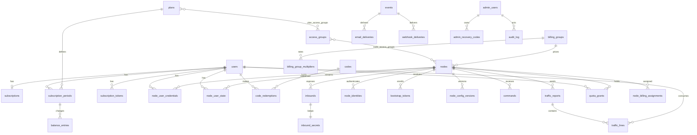

# 4. Модель данных

> Part of [docs/ARCHITECTURE.md](../ARCHITECTURE.md).


### 4.1 Концептуальная модель

| Сущность | Что представляет | Ключевые связи |
| :--- | :--- | :--- |
| User | Учётная запись пользователя | 1:1 Subscription, 1:N NodeUserCredential, 1:N SubscriptionToken |
| AdminUser | Учётная запись административной роли | 1:N RecoveryCode, 1:N AuditLog |
| Plan | Тариф | M:N AccessGroup, 1:N Protocol, 1:N SubscriptionPeriod |
| AccessGroup | Группа доступа | M:N Plan, M:N Node |
| BillingGroup | Тарифицируемая группа с коэффициентом | 1:N Node |
| Node | VPN-сервер | 1:N Inbound, 1:N NodeIdentity, 1:N NodeConfigVersion, 1:N Command |
| Inbound | Пара «нода × профиль» с параметрами подключения | 1:1 InboundSecret |
| NodeUserState | Состояние пользователя на ноде, поток состава | N:1 Node, N:1 User |
| NodeUserCredential | Credentials пары «пользователь × нода» | N:1 Node, N:1 User |
| Subscription | Текущее состояние подписки пользователя | 1:N SubscriptionPeriod |
| SubscriptionPeriod | Период подписки с лимитом и расходом | N:1 Plan |
| Code | Redeem- или Promo-код | 1:N CodeRedemption |
| TrafficReport | Принятый отчёт ноды, ключ идемпотентности | 1:N TrafficLine |
| TrafficLine | Неизменяемый факт потребления за интервал отчёта | N:1 User, N:1 Node |
| TrafficDaily | Суточный агрегат | N:1 User, N:1 Node |
| QuotaGrant | Выданный ноде грант квоты пользователя | N:1 User, N:1 Node |
| Event | Событие уведомления | 1:N EmailDelivery, 1:N WebhookDelivery |
| Job | Задача очереди | — |
| AuditLog | Запись административного действия | — |
| Order, Payment | Заглушки платёжного контура (О-2) | N:1 User |

### 4.2 Логическая модель

СУБД — PostgreSQL 18. Идентификаторы — `uuid` (v7, монотонные по времени), кроме журнальных
таблиц с `bigint identity`. Время — `timestamptz` в UTC (R-52). Байты — `bigint`. Коэффициенты —
целые тысячные (`int`, §4.9). Адреса — `inet`. Перечисления — `enum`-типы PostgreSQL.

Поля с суффиксом `_enc` хранятся зашифрованными на уровне приложения (§7.2); поля с суффиксом
`_hash` — хешем без возможности восстановления.

#### 4.2.1 Учётные записи

```text
users
  id                     uuid PK
  email                  citext UNIQUE            — нормализованный адрес (§16.8)
  email_verified_at      timestamptz NULL
  password_hash          text                     — argon2id
  status                 user_status              — active | blocked | deleted
  language               text                     — ru | en (R-51)
  timezone               text                     — IANA (R-52)
  aup_version            text                     — принятая версия правил (§16.5)
  aup_accepted_at        timestamptz
  announce_consent       boolean                  — канал объявлений (§17.11)
  created_at, updated_at timestamptz
  deleted_at             timestamptz NULL         — стирание PII по UC-14; строка сохраняется

admin_users
  id                     uuid PK
  email                  citext UNIQUE
  password_hash          text
  role                   admin_role               — super_admin | admin | operator | support
  totp_secret_enc        bytea NULL
  totp_enabled_at        timestamptz NULL
  status                 admin_status             — active | blocked
  language               text
  created_at             timestamptz

admin_recovery_codes
  id                     uuid PK
  admin_user_id          uuid FK admin_users
  code_hash              text
  used_at                timestamptz NULL
  INDEX (admin_user_id) WHERE used_at IS NULL

email_tokens
  id                     uuid PK
  user_id                uuid FK users
  kind                   email_token_kind         — verify | reset
  token_hash             text UNIQUE
  expires_at             timestamptz              — срок ОВ-25
  used_at                timestamptz NULL

auth_events                                        — партиционирование по суткам, 90 дней (§16.2)
  id                     bigint NOT NULL DEFAULT nextval('auth_events_id_seq')
  user_id                uuid NULL
  kind                   auth_event_kind          — register | login | logout | reset
  ts                     timestamptz
  source_ip              inet
  user_agent             text
  result                 text                     — success | denied
  PK (ts, id), INDEX (user_id, ts DESC)
```

Сессии пользователей и администраторов хранятся в Redis (§7.1), не в PostgreSQL.

#### 4.2.2 Каталог

```text
plans
  id                     uuid PK
  name                   text UNIQUE
  price_amount           numeric(12,2) NULL       — справочное (О-2)
  price_currency         char(3) NULL             — ОВ-19
  duration_days          int CHECK (> 0)
  traffic_limit_bytes    bigint NULL              — NULL = Unlimited
  device_limit           int NULL
  status                 plan_status              — active | archived
  created_at, updated_at timestamptz

plan_protocols
  plan_id                uuid FK plans
  profile                inbound_profile          — vless_raw_vision | vless_xhttp | trojan_reality
  PK (plan_id, profile)

access_groups
  id                     uuid PK
  name                   text UNIQUE
  description            text

plan_access_groups
  plan_id                uuid FK plans
  access_group_id        uuid FK access_groups
  PK (plan_id, access_group_id)

billing_groups
  id                     uuid PK
  name                   text UNIQUE

billing_group_multipliers                          — история коэффициента группы (§4.9)
  id                     uuid PK
  billing_group_id       uuid FK billing_groups
  multiplier_milli       int CHECK (BETWEEN 0 AND 10000 AND % 100 = 0)
  valid_from             timestamptz
  valid_to               timestamptz NULL         — NULL = действует
  EXCLUDE USING gist (billing_group_id WITH =, tstzrange(valid_from, valid_to) WITH &&)

node_billing_assignments                           — история назначения ноды (§4.9)
  id                     uuid PK
  node_id                uuid FK nodes
  billing_group_id       uuid FK billing_groups
  multiplier_override_milli  int NULL CHECK (BETWEEN 0 AND 10000 AND % 100 = 0)
  valid_from             timestamptz
  valid_to               timestamptz NULL
  EXCLUDE USING gist (node_id WITH =, tstzrange(valid_from, valid_to) WITH &&)
```

Правило целостности R-18: `nodes.billing_group_id NOT NULL` — ровно одна тарифицируемая группа;
поле дублирует действующее назначение из `node_billing_assignments` и обновляется в одной
транзакции с ним.

Разрешение коэффициента для строки отчёта выполняется по `period_start` строки: назначение ноды,
действовавшее в этот момент, затем переопределение, затем коэффициент группы на тот же момент,
затем 1.0. Момент приёма отчёта на выбор не влияет (§5.9).

Смена группы или переопределения закрывает действующий интервал значением `valid_to = now()` и
открывает новый; период агрегации `traffic_hourly` для ноды закрывается принудительно тем же
моментом (§4.9). Интервалы одной ноды покрывают время от ввода в эксплуатацию без пробелов.

#### 4.2.3 Парк нод

```text
nodes
  id                     uuid PK
  code                   text UNIQUE              — JP-Tokyo-01
  name                   text
  country                char(2)
  city                   text
  provider               text
  public_ipv4            inet
  public_ipv6            inet NULL
  fqdn                   text NULL
  status                 node_status              — pending | provisioning | active | degraded |
                                                     offline | maintenance | disabled | suspended
  status_changed_at      timestamptz
  last_heartbeat_at      timestamptz NULL
  missed_heartbeats      int                      — счётчик для Н-15
  agent_version          text NULL
  xray_version           text NULL
  billing_group_id       uuid FK billing_groups NOT NULL   — денормализация действующего назначения
  multiplier_milli       int NULL CHECK           — денормализация действующего переопределения
  resync_required        boolean                  — обязать агента взять полный снапшот (§5.2)
  ok_heartbeats          int                      — подряд успешных интервалов, для Н-15 и §4.7
  bandwidth_mbps         int                      — порог аномалии (§5.9)
  max_conn_per_ip        int                      — Н-29
  desired_config_version int
  applied_config_version int
  desired_users_seq      bigint
  applied_users_seq      bigint
  applied_at             timestamptz NULL
  monthly_cost           numeric(12,2) NULL
  currency               char(3) NULL
  provider_account       text NULL
  cost_valid_from        date NULL
  cost_valid_to          date NULL
  traffic_included_bytes bigint NULL
  traffic_overage_cost   numeric(12,4) NULL
  legal_profile          jsonb                    — Р-10
  created_at             timestamptz
  decommissioned_at      timestamptz NULL
  INDEX (status), INDEX (billing_group_id)

node_ip_history
  id                     bigint identity PK
  node_id                uuid FK nodes
  public_ipv4            inet
  valid_from, valid_to   timestamptz

node_access_groups
  node_id                uuid FK nodes
  access_group_id        uuid FK access_groups
  PK (node_id, access_group_id), INDEX (access_group_id)

bootstrap_tokens
  id                     uuid PK
  node_id                uuid FK nodes
  token_hash             text UNIQUE
  expires_at             timestamptz              — Н-24
  used_at                timestamptz NULL
  created_by             uuid FK admin_users

node_identities
  id                     uuid PK
  node_id                uuid FK nodes
  cert_fingerprint       text UNIQUE              — SHA-256 клиентского сертификата
  token_hash             text
  generation             int
  issued_at              timestamptz
  expires_at             timestamptz
  revoked_at             timestamptz NULL
  INDEX (node_id) WHERE revoked_at IS NULL

inbounds
  id                     uuid PK
  node_id                uuid FK nodes
  profile                inbound_profile
  port                   int CHECK (BETWEEN 1 AND 65535)
  tag                    text
  enabled                boolean
  reality_public_key     text
  reality_short_ids      text[]                   — hex, чётная длина, ≤ 16 символов
  reality_target         text
  reality_server_names   text[]
  reality_min_client_ver text
  reality_max_client_ver text NULL
  reality_xver           int
  reality_limit_fb_up    int
  reality_limit_fb_down  int
  client_fingerprint     text
  client_spider_x        text
  trusted_x_forwarded_for inet[]                  — sockopt, для размещения за CDN (Д-14)
  params                 jsonb                    — поля профиля §4.4: flow, decryption, xhttp_*,
                                                     x_padding_*, uplink_http_method,
                                                     session_placement, session_key
  error_state            text NULL                — недоступность цели (Н-30)
  error_since            timestamptz NULL
  UNIQUE (node_id, profile), UNIQUE (node_id, port)

inbound_secrets
  inbound_id             uuid PK FK inbounds
  private_key_enc        bytea                    — x25519, §7.2
  key_version            int
  rotated_at             timestamptz

node_config_versions
  node_id                uuid FK nodes
  config_version         int
  config_json            jsonb                    — полная конфигурация Xray без credentials
  checksum               text
  created_at             timestamptz
  PK (node_id, config_version)

node_user_credentials
  id                     uuid PK
  user_id                uuid FK users
  node_id                uuid FK nodes
  xray_email             text                     — устойчивый тег u{user_id} (§5.9)
  vless_uuid_enc         bytea
  trojan_password_enc    bytea
  version                int
  rotated_at             timestamptz
  UNIQUE (user_id, node_id), INDEX (node_id)

node_user_state                                    — поток состава, материализованный
  node_id                uuid FK nodes
  user_id                uuid FK users
  state                  user_node_state          — active | suspended_quota | suspended_admin |
                                                     expired | removed
  quota_grant_bytes      bigint
  blocked_ips            inet[]
  updated_seq            bigint                   — users_seq изменения
  updated_at             timestamptz
  PK (node_id, user_id), INDEX (node_id, updated_seq)

commands
  id                     uuid PK                  — command_id
  node_id                uuid FK nodes
  type                   command_type             — restart_xray | rotate_credentials |
                                                     collect_diagnostics | update_agent
  payload                jsonb
  issued_at              timestamptz
  expires_at             timestamptz
  status                 command_status           — issued | delivered | applied | failed | expired
  result                 jsonb NULL
  INDEX (node_id, status)

node_metrics                                       — партиционирование по суткам, 30 дней
  node_id                uuid FK nodes
  ts                     timestamptz
  cpu_pct, mem_pct, disk_pct   real
  net_rx_bytes, net_tx_bytes   bigint
  online_ips             int
  connections            int                      — по данным ОС (§4.7)
  PK (node_id, ts)

node_country_availability                          — R-06, приоритет S
  node_id                uuid FK nodes
  country                char(2)
  available              boolean
  checked_at             timestamptz
  PK (node_id, country)
```

Инкрементальная выдача потока состава: агент передаёт `users_seq`; Control Plane возвращает
строки `node_user_state` с `updated_seq > users_seq`. Полный снапшот — все строки ноды, кроме
`removed`; агент, применяя снапшот, удаляет из inbound пользователей, отсутствующих в нём. Строки
`removed` удаляются задачей уплотнения после подтверждения агентом.

Выделение `updated_seq`: в той же транзакции, что и запись строки, выполняется
`UPDATE nodes SET desired_users_seq = desired_users_seq + 1 WHERE id = $1 RETURNING
desired_users_seq`. Блокировка строки `nodes` упорядочивает коммиты по ноде.

**Why.** Номер из последовательности выделяется до коммита ⇒ транзакция с меньшим номером
может закоммититься позже, агент продвинет курсор и не получит её строку. Потерянной строкой
может оказаться отзыв доступа.

Состав строк: строка `node_user_state` и запись `node_user_credentials` существуют только для
пар, у которых тариф пользователя разделяет с нодой хотя бы одну группу доступа (§11.3). При
изменении групп лишние строки переводятся в `removed`, а credentials отзываются.

Вентиль по статусу ноды (§4.6): `Pending` — запрос состояния отклоняется; `Provisioning` — только
поток структурной конфигурации; `Disabled` и `Suspended` — только строки, снимающие доступ;
остальные статусы — оба потока полностью. При выдаче отфильтрованного ответа курсор `users_seq`
продвигается до наибольшего `updated_seq` выборки, а ноде выставляется `resync_required`; при
выходе из фильтрующего статуса агент обязан взять полный снапшот, который восстанавливает
пропущенные строки.

#### 4.2.4 Подписки и коды

```text
subscriptions
  user_id                uuid PK FK users
  state                  subscription_state       — none | active | suspended_quota |
                                                     suspended_admin | expired
  current_period_id      uuid NULL FK subscription_periods
  device_limit           int NULL                 — снимок из тарифа
  state_changed_at       timestamptz

subscription_periods
  id                     uuid PK
  user_id                uuid FK users
  plan_id                uuid FK plans
  period_start           timestamptz
  period_end             timestamptz
  traffic_limit_bytes    bigint NULL
  used_billable_bytes    bigint                   — денормализация суммы balance_entries
  notified_80_at         timestamptz NULL
  notified_95_at         timestamptz NULL
  exhausted_at           timestamptz NULL
  source                 period_source            — redeem | admin | order
  source_id              uuid NULL
  created_at             timestamptz
  INDEX (user_id, period_end DESC), INDEX (period_end)   — предикат с now() недопустим (не IMMUTABLE)

balance_entries                                    — журнал изменений баланса периода (R-21, R-38)
  id                     bigint identity PK
  period_id              uuid FK subscription_periods
  source                 balance_source           — report | adjustment | bonus | late_report
  delta_billable_bytes   bigint
  ref_key                text                     — ключ отчёта, id кода или id корректировки
  actor_id               uuid NULL
  reason                 text NULL                — обязательно для adjustment
  created_at             timestamptz
  INDEX (period_id, created_at)

subscription_tokens
  id                     uuid PK
  user_id                uuid FK users
  token_hash             text UNIQUE
  issued_at              timestamptz
  revoked_at             timestamptz NULL
  UNIQUE (user_id) WHERE revoked_at IS NULL

subscription_access_log                            — партиционирование по суткам, 30 дней
  id                     bigint NOT NULL DEFAULT nextval('subscription_access_log_id_seq')
  user_id                uuid
  ts                     timestamptz
  domain                 text
  format                 text
  user_agent             text
  source_ip              inet
  country                char(2) NULL
  PK (ts, id), INDEX (user_id, ts DESC)

codes
  id                     uuid PK
  kind                   code_kind                — redeem | promo
  code_hash              text UNIQUE
  code_enc               bytea                    — для экспорта (§4.14)
  batch_id               uuid NULL
  plan_id                uuid NULL FK plans
  expires_at             timestamptz NULL
  max_uses               int
  max_uses_per_user      int
  uses_count             int
  traffic_bonus_bytes    bigint
  duration_bonus_days    int
  created_by             uuid FK admin_users
  created_at             timestamptz
  INDEX (batch_id)

code_redemptions
  id                     uuid PK
  code_id                uuid FK codes
  user_id                uuid FK users
  period_id              uuid FK subscription_periods
  redeemed_at            timestamptz
  INDEX (code_id, user_id)

orders                                             — заглушка, О-2
  id, user_id, plan_id, amount, currency, status, created_at

payments                                           — заглушка, О-2
  id, order_id, provider, provider_ref, amount, currency, status, created_at
```

Контрольная сумма кода (§16.8) — последние два символа кода; проверка выполняется до обращения к
базе.

#### 4.2.5 Учёт трафика

```text
traffic_reports
  node_id                uuid FK nodes
  counter_epoch          uuid
  report_seq             bigint
  period_start           timestamptz
  period_end             timestamptz
  received_at            timestamptz
  status                 report_status            — accepted | duplicate | rejected_time |
                                                     held_anomaly
  node_rx_bytes          bigint                   — счётчики интерфейса (второй источник)
  node_tx_bytes          bigint
  PK (node_id, counter_epoch, report_seq)

traffic_lines                                      — факт, партиционирование по суткам, 14 дней
  node_id                uuid
  counter_epoch          uuid
  report_seq             bigint
  user_id                uuid
  period_start           timestamptz
  period_end             timestamptz
  raw_uplink_bytes       bigint
  raw_downlink_bytes     bigint
  billable_bytes         bigint                   — floor(raw × multiplier)
  multiplier_milli       int                      — применённый коэффициент
  billing_group_id       uuid
  PK (period_start, node_id, counter_epoch, report_seq, user_id)
  INDEX (user_id, period_start), INDEX (node_id, period_start)

traffic_hourly                                     — час, партиции по суткам, 90 дней
  user_id                uuid
  node_id                uuid
  hour_start             timestamptz
  raw_uplink_bytes, raw_downlink_bytes, billable_bytes   bigint
  multiplier_milli       int
  billing_group_id       uuid
  PK (hour_start, user_id, node_id, billing_group_id, multiplier_milli)
  INDEX (user_id, hour_start), INDEX (node_id, hour_start)

traffic_daily                                      — 24 месяца
  user_id                uuid
  node_id                uuid
  day                    date
  raw_uplink_bytes, raw_downlink_bytes, billable_bytes   bigint
  PK (user_id, node_id, day), INDEX (node_id, day)

node_interface_hourly                              — второй источник, 90 дней
  node_id                uuid
  hour_start             timestamptz
  rx_bytes, tx_bytes     bigint
  PK (node_id, hour_start)

traffic_gaps
  id                     uuid PK
  node_id                uuid FK nodes
  gap_start, gap_end     timestamptz
  reason                 text
  estimated_bytes        bigint NULL

reconciliation_runs
  id                     uuid PK
  kind                   reconciliation_kind      — arithmetic | cross_source | continuity
  scope                  jsonb                    — день, нода
  expected, actual       bigint
  delta_pct              numeric(6,3)
  status                 text
  created_at             timestamptz

quota_grants
  id                     uuid PK
  user_id                uuid FK users
  node_id                uuid FK nodes
  period_id              uuid FK subscription_periods
  grant_bytes            bigint
  consumed_bytes         bigint                   — подтверждено отчётами
  issued_at              timestamptz
  issued_seq             bigint
  superseded_at          timestamptz NULL         — выдан следующий грант
  INDEX (user_id, node_id, issued_at DESC), INDEX (period_id)

user_online_ips
  user_id                uuid
  node_id                uuid
  ip                     inet
  last_seen              timestamptz
  PK (user_id, node_id, ip), INDEX (user_id, last_seen DESC)

user_blocked_ips
  user_id                uuid
  ip                     inet
  blocked_since          timestamptz
  PK (user_id, ip)
```

Строка отчёта относится к часу по `period_start`. `traffic_hourly` наполняется при приёме отчёта
в той же транзакции; поздний отчёт (UC-04 A7) добавляет к строке своего часа и порождает запись
`balance_entries` с источником `late_report`.

Трассируемость списания (R-21): в пределах 14 суток — до отчёта по ключу через `traffic_lines`.
Позже — до часа и ноды через `traffic_hourly`, до отчёта через `traffic_reports` (90 дней) и до
изменения баланса через `balance_entries` (24 месяца).
Окно 14 суток покрывает разбор обращений поддержки (§17.5) и сверки §5.9.

#### 4.2.6 Уведомления, задачи, аудит, настройки

```text
events
  id                     uuid PK
  type                   event_type               — 12 типов §4.17
  user_id                uuid NULL
  node_id                uuid NULL
  payload                jsonb
  dedup_key              text UNIQUE              — подавление повторов за период
  created_at             timestamptz

email_deliveries
  id                     uuid PK
  event_id               uuid FK events
  recipient              citext
  language               text
  status                 delivery_status          — pending | sent | bounced | failed
  attempts               int
  last_error             text NULL
  sent_at                timestamptz NULL

webhook_deliveries
  id                     uuid PK
  event_id               uuid FK events
  url                    text
  status                 delivery_status
  attempts               int
  next_attempt_at        timestamptz NULL
  response_code          int NULL

jobs
  id                     bigint identity PK
  queue                  job_queue                — critical | background
  type                   text
  payload                jsonb
  idempotency_key        text                     — частичная уникальность, см. §4.4
  run_at                 timestamptz
  attempts               int
  max_attempts           int
  locked_at              timestamptz NULL
  locked_by              text NULL
  status                 job_status               — pending | running | done | failed | dead
  last_error             text NULL
  created_at             timestamptz
  INDEX (queue, status, run_at) WHERE status = 'pending'
  UNIQUE (idempotency_key) WHERE status IN ('pending', 'running')

audit_log                                          — append-only (§7.2)
  id                     bigint identity PK
  ts                     timestamptz
  actor_type             actor_type               — admin | user | system
  actor_id               uuid NULL
  actor_role             text NULL
  session_id             text NULL
  impersonated_user_id   uuid NULL                — режим работы от лица пользователя (§5.11)
  user_agent             text NULL
  action                 text
  entity_type            text
  entity_id              text
  old_value              jsonb NULL
  new_value              jsonb NULL
  ip                     inet NULL
  result                 text                     — success | denied | error (§4.16)
  INDEX (ts), INDEX (entity_type, entity_id), INDEX (actor_id, ts)

settings
  key                    text PK                  — registration_mode, subscription_domains,
                                                     state_generation, captcha, smtp, thresholds
  value                  jsonb
  updated_at             timestamptz
```

### 4.3 Диаграмма сущностей

Диаграмма показывает ядро модели. Опущены журнальные и служебные таблицы: `traffic_daily`,
`node_metrics`, `subscription_access_log`, `auth_events`, `jobs`, `settings`, `user_online_ips`,
`user_blocked_ips`, `traffic_gaps`, `reconciliation_runs`, `node_ip_history`,
`node_country_availability`, `orders`, `payments`. Их связи — по идентификаторам, без внешних
ключей на партициях.



### 4.4 Правила целостности и индексы

| Правило | Реализация |
| :--- | :--- |
| Ровно одна тарифицируемая группа на ноду (R-18) | `nodes.billing_group_id NOT NULL` |
| Коэффициент 0.0–10.0 с шагом 0.1 (R-23) | `CHECK` на `multiplier_milli` в двух таблицах |
| Один профиль и один порт на ноду (R-03) | `UNIQUE (node_id, profile)`, `UNIQUE (node_id, port)` |
| Идемпотентность отчётов (R-21) | PK `(node_id, counter_epoch, report_seq)` |
| Одна активная ссылка подписки (R-14) | частичный `UNIQUE (user_id) WHERE revoked_at IS NULL` |
| Один credential на пару «пользователь × нода» (R-19) | `UNIQUE (user_id, node_id)` |
| Неизменяемость `billable_bytes` (R-23) | `traffic_lines` без `UPDATE` у роли приложения |
| Append-only Audit Log (R-37) | `REVOKE UPDATE, DELETE` у роли приложения; триггер `RAISE` |
| Один активный период на пользователя | `subscriptions.current_period_id` + проверка в домене |
| Датированность коэффициента (B-1) | интервалы `billing_group_multipliers` и `node_billing_assignments` без пересечений (`EXCLUDE`) |
| Порядок изменений потока состава (M-2) | `updated_seq` только через `UPDATE nodes ... RETURNING`; выделение из последовательности запрещено |
| Состав потока по группам доступа (§11.3) | строки `node_user_state` только для пересечения групп; проверка в домене и задача уплотнения |
| Расшифровка credentials по identity | `node_id` берётся из `node_identities` по отпечатку; параметр запроса не используется |
| Изменение баланса журналируется (M-4) | запись `balance_entries` в той же транзакции; `used_billable_bytes` — денормализация |
| Идемпотентность задач (R-46) | частичная уникальность `idempotency_key` по статусам `pending`, `running` |
| Накопление `traffic_hourly` | значения строки часа только увеличиваются; перезапись и уменьшение запрещены |
| Отсутствие PII вне `users` (B-3) | `old_value`, `new_value`, `ip` в `audit_log` не содержат адресов почты и паролей; ссылки — по `user_id` |

Индексы для частых запросов:

| Запрос | Индекс |
| :--- | :--- |
| Дельта потока состава для ноды | `node_user_state (node_id, updated_seq)` |
| Выдача подписки: ноды по группам доступа | `node_access_groups (access_group_id)`, `nodes (status)` |
| Статистика пользователя за период | `traffic_lines (user_id, period_start)` |
| Сверка по ноде за сутки | `traffic_lines (node_id, period_start)`, `node_interface_hourly` PK |
| Истечение подписок | `subscription_periods (period_end)` — без предиката: `now()` в предикате индекса PostgreSQL не допускает |
| Выборка задач | `jobs (queue, status, run_at) WHERE status = 'pending'` |
| Обращения к подписке в карточке | `subscription_access_log (user_id, ts DESC)` |
| Аутентификация ноды по отпечатку | `node_identities (cert_fingerprint)` |

### 4.5 Партиционирование и сроки хранения

| Таблица | Партиция | Хранение | Основание |
| :--- | :--- | :--- | :--- |
| `traffic_lines` | по суткам | 14 дней | окно трассируемости §4.2.5 |
| `traffic_hourly` | по суткам | 90 дней | Н-21, Н-22 |
| `traffic_reports` | нет | 90 дней | дедупликация; не меньше глубины буфера Н-8 |
| `traffic_daily` | нет | 24 месяца | Н-21 |
| `auth_events` | по суткам | 90 дней | §16.2 |
| `jobs` со статусом `done` | нет | 7 дней | обслуживание индекса |
| `events`, `email_deliveries`, `webhook_deliveries` | нет | 90 дней | разбор доставок |
| `commands` завершённые | нет | 90 дней | разбор инцидентов |
| `quota_grants` с `superseded_at` | нет | 30 дней | разбор перерасхода |
| `user_online_ips` | нет | по `last_seen`, окно ОВ-23 | лимит адресов |
| `email_tokens`, `bootstrap_tokens` использованные или просроченные | нет | 7 дней | — |
| `balance_entries` | нет | 24 месяца | носитель трассируемости списания после `traffic_lines` |
| `billing_group_multipliers`, `node_billing_assignments` | нет | бессрочно | аудит коэффициентов R-23; переживают любой поздний отчёт |
| `node_interface_hourly` | нет | 90 дней | §5.9 |
| `subscription_access_log` | по суткам | 30 дней | §16.2 |
| `node_metrics` | по суткам | 30 дней | §17.4 |
| `audit_log` | нет | 12 месяцев | Н-23 |

Партиции создаются планировщиком на семь суток вперёд; устаревшие отсоединяются и удаляются той же
задачей. Объём `traffic_lines` при О-3: до 1 000 × 10 × 1 440 строк в сутки в худшем случае;
фактический объём ограничен числом активных пар «пользователь × нода» в каждом интервале.

### 4.6 Миграции

- Инструмент: `yoyo-migrations`, файлы `.sql` с явным `rollback`.
- Правило expand/contract (§17.2): добавление колонки и обратно совместимый код в выпуске N;
  удаление старой колонки в выпуске N+1.
- Схема: все объекты Control Plane — в схеме `control_plane`, не в `public` (решение
  2026-09-08: в одном кластере могут соседствовать другие решения, общая `public` даёт
  конфликты имён). Схему создаёт bootstrap ролей, владелец — `app_owner`; роли приложения
  получают `search_path = control_plane`; расширения устанавливаются в неё же; каждая миграция
  начинается с `SET LOCAL ROLE app_owner; SET LOCAL search_path TO control_plane`.
- Роли базы:
  - `app_owner` — владелец всех объектов; приложением не используется;
  - `app_rw` — C-01…C-03, только DML; без `UPDATE`/`DELETE` на `audit_log`, `traffic_lines`,
    `balance_entries`; на `traffic_hourly` разрешён `UPDATE` для накопления, `DELETE` запрещён;
  - `app_migrate` — миграции, отдельное подключение при старте C-01 (§10.2);
  - `app_backup` — только чтение, для C-11.
- Обслуживание партиций и сроков хранения (§4.5) выполняется функциями `SECURITY DEFINER`,
  принадлежащими `app_owner`; C-03 вызывает их под `app_rw`. Удаление по сроку — отсоединение
  партиции или вызов такой функции, а не `DELETE` от роли приложения.
- Триггер `audit_log` запрещает `UPDATE` и `DELETE` для всех ролей, кроме функции удаления по
  сроку хранения.
- Перечисления расширяются `ALTER TYPE ... ADD VALUE`; значения не удаляются.
- Данных для миграции нет (Д-10); первая миграция создаёт схему целиком, начиная с расширений
  `btree_gist` (для `EXCLUDE` по `uuid`) и `citext` (для адресов почты).
