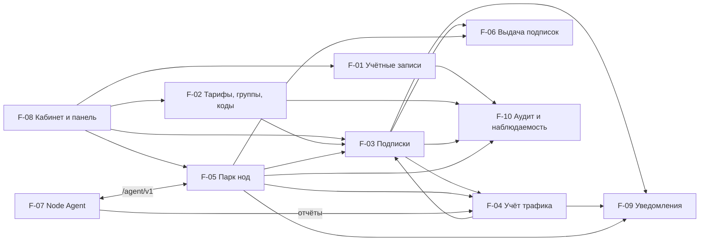

# 2. Функциональная архитектура

> Part of [docs/ARCHITECTURE.md](../ARCHITECTURE.md).

### 2.1 Функциональные компоненты

**F-01 Учётные записи и сессии**

Назначение: регистрация, вход, восстановление, сессии пользователей и администраторов.

Функции:

- Регистрация с режимами, CAPTCHA, принятием правил (вход: форма; выход: учётная запись
  «не подтверждена»; UC-02).
- Подтверждение адреса и восстановление пароля одноразовыми ссылками (UC-02, UC-15).
- Сессии с серверным состоянием, «выход везде», инвалидация при блокировке (UC-15, UC-16).
- Второй фактор и резервные коды для административных ролей (R-36).
- Удаление аккаунта с обезличиванием (UC-14).

Зависимости: F-09 (уведомления), F-10 (аудит). От F-01 зависят все интерфейсы.

**F-02 Тарифы, группы и коды**

Назначение: каталог тарифов, группы доступа, тарифицируемые группы, Redeem- и Promo-коды.

Функции:

- CRUD тарифов и групп с ограничением «ровно одна тарифицируемая группа на ноду» (UC-09).
- Генерация, экспорт и активация кодов с контрольной суммой (UC-02, UC-09).
- Разрешение коэффициента на момент `period_start` строки отчёта: нода → тарифицируемая группа
  → 1.0 (R-23).

Зависимости: F-10. От F-02 зависят F-03, F-04, F-06.

**F-03 Подписки и состояние пользователя**

Назначение: жизненный цикл подписки и состояние пользователя на нодах.

Функции:

- Активация, продление, смена тарифа, истечение по правилам §4.11 (UC-02, UC-06).
- Переходы `active` / `suspended_quota` / `suspended_admin` / `expired` (UC-05, UC-06).
- Публикация изменений в поток состава каждой ноды (R-04, R-24).
- Выдача и учёт грантов квоты (R-26).

Зависимости: F-02, F-04, F-05. От F-03 зависят F-06, F-07.

**F-04 Учёт трафика**

Назначение: приём отчётов, списание, хранение, сверки.

Функции:

- Приём отчёта по ключу идемпотентности, проверка времени и прироста (UC-04).
- Вычисление `billable_bytes` по коэффициенту периода, запись почасовой строки (UC-04).
- Суточная агрегация, три сверки, фиксация пропусков (R-21, R-22).
- Пороги 80/95/100 % и переход в `suspended_quota` (UC-05).

Зависимости: F-02, F-05. От F-04 зависят F-03, F-08, F-09.

**F-05 Парк нод**

Назначение: ноды, inbound, ключевой материал, статусы, команды, версии.

Функции:

- Ввод ноды: bootstrap-токен, обмен на identity, подтверждение (UC-01).
- Генерация ключевого материала REALITY и структурной конфигурации (R-03).
- Heartbeat, статусы, матрица влияния, метрики (UC-07).
- Команды с идемпотентностью и сроком действия (UC-11).
- Компрометация: отзыв identity, ротация credentials и ключей (UC-12).

Зависимости: F-10. От F-05 зависят F-03, F-04, F-06, F-07.

**F-06 Выдача подписок**

Назначение: subscription-эндпоинт, форматы, страница подписки.

Функции:

- Проверка токена, выбор формата, отбор пар «нода × профиль» (UC-03).
- Генераторы `base64` и `singbox`, матрица применимости (R-15).
- Заголовки ответа и состояния эндпоинта (R-14).
- Запись обращения для поддержки и лимита адресов (R-14, R-38).

Зависимости: F-02, F-03, F-05. От F-06 зависит F-08.

**F-07 Node Agent**

Назначение: исполнение желаемого состояния на ноде.

Функции:

- Enrollment, long-poll, применение двух потоков, подтверждение курсоров (UC-01, R-04).
- Горячее управление пользователями Xray, перезапуск при смене конфигурации (R-04).
- Чтение счётчиков, эпохи, буфер, отчёты, локальный грант квоты (UC-04, UC-05 A1).
- Принудительный разрыв соединений отключённого пользователя — механизм по ОВ-22 из трёх
  кандидатов §4.11 (R-25, Н-17а).
- Правила маршрутизации по адресам, nftables-лимиты и egress-фильтры (UC-08).
- Счётчики признаков перепродажи по адресу источника: частота новых соединений и их число —
  из conntrack nftables (R-29, приоритет S).
- Метрики ОС и Xray, выполнение команд, самообновление (UC-11).

Зависимости: Xray-core, Control Plane. От F-07 зависит вся выдача.

**F-08 Кабинет и панель**

Назначение: интерфейсы пользователя, администратора, поддержки.

Функции:

- Кабинет: подписка, ссылки, QR, перевыпуск, статистика, профиль, мастер подключения (UC-16).
- Панель: разделы §4.15, карточки ноды и пользователя, данные поддержки (UC-09, UC-13).
- Локализация RU/EN, часовой пояс профиля (R-51, R-52).

Зависимости: F-01…F-06 через API.

**F-09 Уведомления**

Назначение: пользовательские и операторские события по почте и webhook.

Функции:

- Порождение событий, подавление повторов, язык получателя (R-39).
- Доставка почты через реле с обработкой отказов (R-41).
- Доставка webhook с повторами и идентификатором события (R-39, R-40).

Зависимости: F-03, F-04, F-05.

**F-10 Аудит и наблюдаемость**

Назначение: Audit Log, логи, метрики, алерты.

Функции:

- Append-only журнал административных действий (R-37).
- Метрики приложения и нод, правила алертов с приоритетами (R-47).

Зависимости: нет. От F-10 зависят все компоненты, изменяющие данные.

### 2.1а Покрытие сценариев

| UC | Функциональные компоненты | Системные компоненты |
| :--- | :--- | :--- |
| UC-01 | F-05, F-07 | C-01, C-05, C-06, C-09 |
| UC-02 | F-01, F-02, F-03, F-09 | C-01, C-02, C-08 |
| UC-03 | F-06 | C-01, C-09 |
| UC-04 | F-04, F-07 | C-05, C-06, C-01, C-07 |
| UC-05 | F-03, F-04, F-07, F-09 | C-01, C-02, C-05 |
| UC-06 | F-02, F-03, F-09 | C-01, C-02 |
| UC-07 | F-05, F-07, F-09 | C-01, C-03, C-05, C-10 |
| UC-08 | F-04, F-07, F-08 | C-05, C-01 |
| UC-09 | F-02, F-05, F-10 | C-01, C-04 |
| UC-10 | F-10, F-05, F-07 | C-11, C-07, C-01, C-05 |
| UC-11 | F-05, F-07 | C-01, C-05 |
| UC-12 | F-05, F-01, F-09 | C-01, C-02, C-05 |
| UC-13 | F-08, F-10 | C-04, C-01 |
| UC-14 | F-01, F-05 | C-01, C-02 |
| UC-15 | F-01, F-09 | C-01, C-02 |
| UC-16 | F-08, F-03, F-06 | C-04, C-01 |

### 2.2 Диаграмма функциональных компонентов

