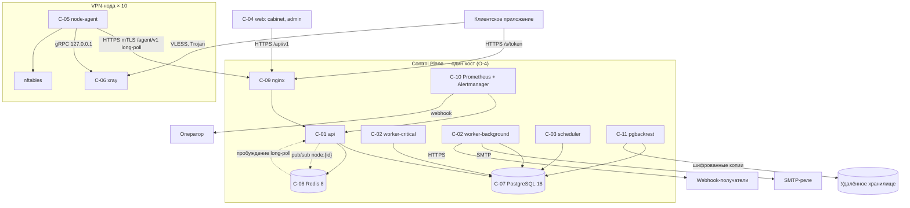

# 3. Системная архитектура

> Part of [docs/ARCHITECTURE.md](../ARCHITECTURE.md).

### 3.1 Архитектурный стиль

Модульный монолит Control Plane с выделенными процессами исполнителей задач; отдельный агент на
ноде.

**Why.** О-3 задаёт 1 000 пользователей и 10 нод ⇒ нагрузка Н-1…Н-4 не превышает единиц
запросов в секунду. О-4 и О-6 задают один хост и одного оператора ⇒ каждый дополнительный сервис
увеличивает поверхность эксплуатации без выигрыша в нагрузке. Разделение на процессы `api`,
`worker` и `scheduler` необходимо по §5.8: рассылка не должна задерживать отзыв доступа.

Монолит разбит на модули по функциональным компонентам §2.1. Границы модулей — интерфейсы
Python-пакетов; общая база данных; межмодульные вызовы синхронные внутри процесса.

Термины потоков (§3.4 источника): **поток структурной конфигурации** — полная конфигурация Xray
ноды с курсором `config_version`; **поток состава пользователей** — строки состояния пользователей
ноды с курсором `users_seq`. Далее в документе они называются «поток конфигурации» и «поток
состава».

Очередь задач — таблица PostgreSQL с `FOR UPDATE SKIP LOCKED`, а не внешний брокер.

**Why.** Изменение баланса и постановка задачи «отозвать доступ» происходят в одной транзакции ⇒
задача не теряется и не дублируется относительно состояния базы (transactional outbox). Redis при
этом остаётся для сессий, счётчиков частоты и пробуждения long-poll; §4.20 требует его в составе.

### 3.2 Системные компоненты

**C-01 `api` — Control Plane API**

- Тип: backend-сервис.
- Назначение: `/api/v1` для кабинета и панели, `/agent/v1` для агентов, `/s/{token}` для
  клиентов, страница подписки.
- Функции: F-01, F-02, F-03 (синхронная часть), F-05 (приём heartbeat, состояние, команды), F-06.
- Технологии: Python 3.14, FastAPI, asyncpg, Jinja2 для страницы подписки.
- Интерфейсы: входящий HTTP от `nginx`; исходящий — PostgreSQL, Redis.
- Зависимости: C-07, C-08.
- Состояние в процессе не хранится (§4.20): сессии и счётчики — в Redis.
- Модель конкурентности: uvicorn с двумя процессами по числу ядер хоста; асинхронные обработчики;
  удерживаемый long-poll не занимает соединение к PostgreSQL — соединение возвращается в пул до
  пробуждения. Пул: 10 соединений на процесс.

**C-02 `worker` — исполнители задач**

- Тип: backend-процессы, два экземпляра с разными очередями.
- Назначение: `worker-critical` — генерация конфигураций, публикация состава пользователей,
  отзыв доступа, выдача грантов, список блокируемых адресов; `worker-background` — почта,
  webhook, агрегация, сверки, экспорт кодов.
- Функции: F-03 (асинхронная часть), F-04, F-09.
- Технологии: Python 3.14, тот же код, что C-01; запуск `python -m app.jobs.worker --queue`.
- Интерфейсы: PostgreSQL (очередь и данные), Redis (pub/sub пробуждения), SMTP-реле, webhook.
- Зависимости: C-07, C-08, внешнее SMTP-реле.

**C-03 `scheduler` — планировщик**

- Тип: backend-процесс, один экземпляр.
- Назначение: постановка периодических задач: истечение подписок, пороги, суточная агрегация,
  сверки, удаление по срокам хранения, проверка `reality_target`, детекция `Offline`.
- Технологии: Python 3.14; блокировка лидера через `pg_advisory_lock`.
- Зависимости: C-07.

**C-04 `web` — интерфейсы**

- Тип: frontend, статические файлы.
- Назначение: кабинет (mobile-first) и панель (desktop) — два приложения одного репозитория.
- Технологии: TypeScript, React 19, Vite; клиент API генерируется из OpenAPI.
- Интерфейсы: обслуживается `nginx`; обращается к `/api/v1`.

**C-05 `node-agent` — агент ноды**

- Тип: системный сервис на ноде, один статический бинарный файл.
- Назначение: F-07.
- Технологии: Go 1.27; gRPC-клиент Xray; SQLite (`modernc.org/sqlite`, без CGO) для буфера
  отчётов и локального состояния; управление `xray` через systemd; nftables через `nft`.
- Интерфейсы: исходящий HTTPS с mTLS к `nginx`/C-01; локальный gRPC к C-06 по `127.0.0.1`.
- Зависимости: C-06, systemd, nftables.

**C-06 `xray` — Xray-core**

- Тип: сервис на ноде.
- Назначение: обслуживание VPN-подключений по трём профилям §4.4.
- Технологии: Xray-core v26.3.27 (О-8); `api.listen 127.0.0.1:10085` с `HandlerService`,
  `StatsService`, `RoutingService`; политика уровня с `statsUserUplink`, `statsUserDownlink`,
  `statsUserOnline`.
- Интерфейсы: входящие подключения клиентов на портах inbound; gRPC от C-05.

**C-07 `postgres` — база данных**

- Тип: СУБД.
- Технологии: PostgreSQL 18; архивация WAL для Н-9 (§4.20).
- Данные: все сущности §4; очередь задач; партиционированные таблицы статистики.

**C-08 `redis` — вспомогательное хранилище**

- Тип: key-value.
- Технологии: Redis 8, `appendonly yes` (§4.20).
- Данные: сессии (TTL), счётчики ограничения частоты, каналы pub/sub `node:{id}` для пробуждения
  long-poll, одноразовые ссылки.

**C-09 `nginx` — обратный прокси**

- Тип: инфраструктура.
- Назначение: TLS для доменов кабинета, панели и двух доменов подписки.
- Агентский `server` на выделенном порту для `/agent/v1` с обязательной проверкой клиентского
  сертификата (mTLS) и передачей отпечатка в C-01.
- Отдельный `server` на другом порту только для `/agent/v1/enroll`, без клиентского сертификата.
- Пути `/s/` исключены из журнала доступа (Н-25).
- Правило границы 1: заголовок отпечатка перезаписывается прокси безусловно и не принимается от
  клиента.
- Правило границы 2: C-01 не публикует портов наружу и достижим только из сети Compose.
- Правило границы 3: на `server` агентов `ssl_verify_client on`, а не `optional`.
- Технологии: nginx 1.30.

**C-10 `prometheus` + `alertmanager` — метрики и алерты**

- Тип: инфраструктура наблюдаемости.
- Назначение: сбор `/metrics` C-01…C-03, метрик нод через C-01; правила §17.4; доставка алертов
  webhook оператору.
- Технологии: Prometheus 3.14, Alertmanager 0.34.

**C-11 `backup` — резервное копирование**

- Тип: инфраструктура.
- Назначение: базовые копии и архив WAL PostgreSQL в удалённое хранилище, шифрование ключом
  вне контура (Н-12); копия секретов конфигурации.
- Технологии: `pgbackrest` 2.59 с шифрованием репозитория; хранилище S3-совместимое (ОВ-A1).

### 3.3 Диаграмма компонентов

### 3.4 Потоки данных

| Поток | Путь | Периодичность |
| :--- | :--- | :--- |
| Состояние ноды | PG → C-01 (вентиль по статусу, §5.2) → long-poll → C-05 → C-06 | При изменении, удержание 30 с |
| Пробуждение long-poll | C-02 → Redis pub/sub → C-01 | При записи в поток ноды |
| Отчёт о трафике | C-06 → C-05 → буфер SQLite → C-01 → PG | Раз в 60 с |
| Списание и пороги | C-01 приём → PG → задача critical → C-02 | Синхронно при приёме |
| Подписка клиенту | CLI → C-09 → C-01 → PG | По запросу клиента |
| Уведомления | Событие в PG → задача background → SMTP / webhook | По событию |
| Метрики нод | C-05 → C-01 → PG (30 дней) → `/metrics` → C-10 | Раз в 60 с |
