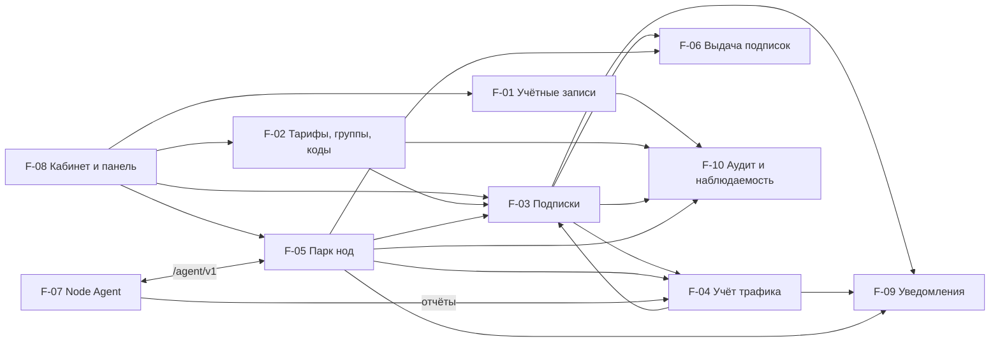
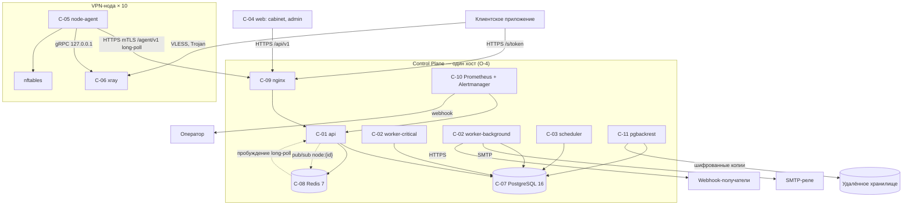
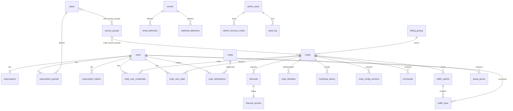

# Архитектура: Control Plane для распределённой VPN-инфраструктуры

Живой документ. Обновляется на месте; по-задачно не архивируется. Редакция: 2026-09-07, после
TASK 001.

Источники: `docs/TASK.md` (Task 001), `docs/idea.md` (постановка). Ссылки вида `§N.N`, `Н-N`,
`Д-N`, `О-N` ведут в `docs/idea.md`; `R-NN`, `UC-NN`, `AC-NN`, `I-NN.N` — в `docs/TASK.md`.

## 1. Описание задачи

Задача: `docs/TASK.md`, Task 001 `vpn-control-plane-mvp`.

Система состоит из центрального Control Plane и парка VPN-нод. Control Plane хранит пользователей,
подписки, тарифы, ноды и учёт трафика; выдаёт подписки клиентским приложениям; управляет нодами
через собственный Node Agent. Нода несёт Xray-core и Node Agent; агент устанавливает исходящее
соединение к Control Plane (§3.3).

Границы MVP: до 1 000 активных пользователей и 10 нод (О-3), один хост Docker Compose (О-4), один
оператор (О-6), без приёма платежей (О-2). Три профиля подключения на ноду: `vless-raw-vision`,
`vless-xhttp`, `trojan-reality` (§4.4). Форматы подписки `base64` и `singbox` (§5.6).

Решение build / adopt / fork не принято (§0.3). Настоящий документ описывает вариант Build; при
выборе Adopt компоненты C-05 и C-06 заменяются интеграцией с панелью, остальное сохраняется в
объёме, определяемом PoC-2.

### 1.1 Структура репозитория

```text
control-plane/            Python 3.12, FastAPI
  app/
    api/                  /api/v1 — кабинет и панель (R-01, R-34)
    agent_api/            /agent/v1 — Node API (R-04)
    subscription/         /s/{token} — эндпоинт и страница подписки (R-14…R-17)
    domain/               предметная логика: подписки, квоты, коэффициенты, коды
    accounting/           приём отчётов, сверки, агрегация (R-19…R-23)
    jobs/                 очереди и обработчики (R-46)
    security/             сессии, второй фактор, RBAC, шифрование (R-35, R-36, R-44)
    notifications/        события, почта, webhook (R-39…R-41)
  migrations/             SQL-миграции, expand/contract (R-42)
  tests/
node-agent/               Go 1.23
  cmd/node-agent/
  internal/
    enroll/               bootstrap и identity (R-02)
    sync/                 long-poll, два потока, команды (R-04)
    xray/                 генерация конфигурации, gRPC-клиент (R-03, R-19)
    accounting/           счётчики, эпохи, буфер, отчёты (R-19, R-20)
    quota/                грант квоты (R-26)
    guard/                правила маршрутизации, nftables (R-27, R-28)
    metrics/              метрики ОС и Xray (R-05)
web/                      TypeScript, React
  apps/cabinet/           личный кабинет, mobile-first (R-10…R-12, R-53)
  apps/admin/             административная панель (R-34)
  packages/api-client/    клиент из OpenAPI (R-50)
  packages/i18n/          файлы локализации RU, EN (R-51)
deploy/
  compose/                docker-compose для стенда и промышленного контура (R-42)
  nginx/                  обратный прокси, TLS, mTLS для /agent (R-44)
  node/                   bootstrap-скрипт, systemd-юниты, nftables (R-02, R-28)
  prometheus/             метрики и правила алертов (R-47)
docs/
```

## 2. Функциональная архитектура

### 2.1 Функциональные компоненты

**F-01 Учётные записи и сессии**

Назначение: регистрация, вход, восстановление, сессии пользователей и администраторов.

Функции:

- Регистрация с режимами, CAPTCHA, принятием правил (вход: форма; выход: учётная запись
  «не подтверждена»; UC-02).
- Подтверждение адреса и восстановление пароля одноразовыми ссылками (UC-02, UC-15).
- Сессии с серверным состоянием, «выход везде», инвалидация при блокировке (UC-15, UC-16).
- Второй фактор и резервные коды для административных ролей (R-36).
- Удаление аккаунта с обезличиванием (UC-14).

Зависимости: F-09 (уведомления), F-10 (аудит). От F-01 зависят все интерфейсы.

**F-02 Тарифы, группы и коды**

Назначение: каталог тарифов, группы доступа, тарифицируемые группы, Redeem- и Promo-коды.

Функции:

- CRUD тарифов и групп с ограничением «ровно одна тарифицируемая группа на ноду» (UC-09).
- Генерация, экспорт и активация кодов с контрольной суммой (UC-02, UC-09).
- Разрешение коэффициента: нода → тарифицируемая группа → 1.0 (R-23).

Зависимости: F-10. От F-02 зависят F-03, F-04, F-06.

**F-03 Подписки и состояние пользователя**

Назначение: жизненный цикл подписки и состояние пользователя на нодах.

Функции:

- Активация, продление, смена тарифа, истечение по правилам §4.11 (UC-02, UC-06).
- Переходы `active` / `suspended_quota` / `suspended_admin` / `expired` (UC-05, UC-06).
- Публикация изменений в поток состава пользователей каждой ноды (R-04, R-24).
- Выдача и учёт грантов квоты (R-26).

Зависимости: F-02, F-04, F-05. От F-03 зависят F-06, F-07.

**F-04 Учёт трафика**

Назначение: приём отчётов, списание, хранение, сверки.

Функции:

- Приём отчёта по ключу идемпотентности, проверка времени и прироста (UC-04).
- Вычисление `billable_bytes` по коэффициенту периода, запись почасовой строки (UC-04).
- Суточная агрегация, три сверки, фиксация пропусков (R-21, R-22).
- Пороги 80/95/100 % и переход в `suspended_quota` (UC-05).

Зависимости: F-02, F-05. От F-04 зависят F-03, F-08, F-09.

**F-05 Парк нод**

Назначение: ноды, inbound, ключевой материал, статусы, команды, версии.

Функции:

- Ввод ноды: bootstrap-токен, обмен на identity, подтверждение (UC-01).
- Генерация ключевого материала REALITY и структурной конфигурации (R-03).
- Heartbeat, статусы, матрица влияния, метрики (UC-07).
- Команды с идемпотентностью и сроком действия (UC-11).
- Компрометация: отзыв identity, ротация credentials и ключей (UC-12).

Зависимости: F-10. От F-05 зависят F-03, F-04, F-06, F-07.

**F-06 Выдача подписок**

Назначение: subscription-эндпоинт, форматы, страница подписки.

Функции:

- Проверка токена, выбор формата, отбор пар «нода × профиль» (UC-03).
- Генераторы `base64` и `singbox`, матрица применимости (R-15).
- Заголовки ответа и состояния эндпоинта (R-14).
- Запись обращения для поддержки и лимита адресов (R-14, R-38).

Зависимости: F-02, F-03, F-05. От F-06 зависит F-08.

**F-07 Node Agent**

Назначение: исполнение желаемого состояния на ноде.

Функции:

- Enrollment, long-poll, применение двух потоков, подтверждение курсоров (UC-01, R-04).
- Горячее управление пользователями Xray, перезапуск при смене конфигурации (R-04).
- Чтение счётчиков, эпохи, буфер, отчёты, локальный грант квоты (UC-04, UC-05 A1).
- Правила маршрутизации по адресам, nftables-лимиты и egress-фильтры (UC-08).
- Метрики ОС и Xray, выполнение команд, самообновление (UC-11).

Зависимости: Xray-core, Control Plane. От F-07 зависит вся выдача.

**F-08 Кабинет и панель**

Назначение: интерфейсы пользователя, администратора, поддержки.

Функции:

- Кабинет: подписка, ссылки, QR, перевыпуск, статистика, профиль, мастер подключения (UC-16).
- Панель: разделы §4.15, карточки ноды и пользователя, данные поддержки (UC-09, UC-13).
- Локализация RU/EN, часовой пояс профиля (R-51, R-52).

Зависимости: F-01…F-06 через API.

**F-09 Уведомления**

Назначение: пользовательские и операторские события по почте и webhook.

Функции:

- Порождение событий, подавление повторов, язык получателя (R-39).
- Доставка почты через реле с обработкой отказов (R-41).
- Доставка webhook с повторами и идентификатором события (R-39, R-40).

Зависимости: F-03, F-04, F-05.

**F-10 Аудит и наблюдаемость**

Назначение: Audit Log, логи, метрики, алерты.

Функции:

- Append-only журнал административных действий (R-37).
- Метрики приложения и нод, правила алертов с приоритетами (R-47).

Зависимости: нет. От F-10 зависят все компоненты, изменяющие данные.

### 2.2 Диаграмма функциональных компонентов



## 3. Системная архитектура

### 3.1 Архитектурный стиль

Модульный монолит Control Plane с выделенными процессами исполнителей задач; отдельный агент на
ноде.

**Why.** О-3 задаёт 1 000 пользователей и 10 нод ⇒ нагрузка Н-1…Н-4 не превышает единиц
запросов в секунду. О-4 и О-6 задают один хост и одного оператора ⇒ каждый дополнительный сервис
увеличивает поверхность эксплуатации без выигрыша в нагрузке. Разделение на процессы `api`,
`worker` и `scheduler` необходимо по §5.8: рассылка не должна задерживать отзыв доступа.

Монолит разбит на модули по функциональным компонентам §2.1. Границы модулей — интерфейсы
Python-пакетов; общая база данных; межмодульные вызовы синхронные внутри процесса.

Очередь задач — таблица PostgreSQL с `FOR UPDATE SKIP LOCKED`, а не внешний брокер.

**Why.** Изменение баланса и постановка задачи «отозвать доступ» происходят в одной транзакции ⇒
задача не теряется и не дублируется относительно состояния базы (transactional outbox). Redis при
этом остаётся для сессий, счётчиков частоты и пробуждения long-poll; §4.20 требует его в составе.

### 3.2 Системные компоненты

**C-01 `api` — Control Plane API**

- Тип: backend-сервис.
- Назначение: `/api/v1` для кабинета и панели, `/agent/v1` для агентов, `/s/{token}` для
  клиентов, страница подписки.
- Функции: F-01, F-02, F-03 (синхронная часть), F-05 (приём heartbeat, состояние, команды), F-06.
- Технологии: Python 3.12, FastAPI, asyncpg, Jinja2 для страницы подписки.
- Интерфейсы: входящий HTTP от `nginx`; исходящий — PostgreSQL, Redis.
- Зависимости: C-07, C-08.
- Состояние в процессе не хранится (§4.20): сессии и счётчики — в Redis.

**C-02 `worker` — исполнители задач**

- Тип: backend-процессы, два экземпляра с разными очередями.
- Назначение: `worker-critical` — генерация конфигураций, публикация состава пользователей,
  отзыв доступа, выдача грантов, список блокируемых адресов; `worker-background` — почта,
  webhook, агрегация, сверки, экспорт кодов.
- Функции: F-03 (асинхронная часть), F-04, F-09.
- Технологии: Python 3.12, тот же код, что C-01; запуск `python -m app.jobs.worker --queue`.
- Интерфейсы: PostgreSQL (очередь и данные), Redis (pub/sub пробуждения), SMTP-реле, webhook.
- Зависимости: C-07, C-08, внешнее SMTP-реле.

**C-03 `scheduler` — планировщик**

- Тип: backend-процесс, один экземпляр.
- Назначение: постановка периодических задач: истечение подписок, пороги, суточная агрегация,
  сверки, удаление по срокам хранения, проверка `reality_target`, детекция `Offline`.
- Технологии: Python 3.12; блокировка лидера через `pg_advisory_lock`.
- Зависимости: C-07.

**C-04 `web` — интерфейсы**

- Тип: frontend, статические файлы.
- Назначение: кабинет (mobile-first) и панель (desktop) — два приложения одного репозитория.
- Технологии: TypeScript, React 18, Vite; клиент API генерируется из OpenAPI.
- Интерфейсы: обслуживается `nginx`; обращается к `/api/v1`.

**C-05 `node-agent` — агент ноды**

- Тип: системный сервис на ноде, один статический бинарный файл.
- Назначение: F-07.
- Технологии: Go 1.23; gRPC-клиент Xray; SQLite (`modernc.org/sqlite`, без CGO) для буфера
  отчётов и локального состояния; управление `xray` через systemd; nftables через `nft`.
- Интерфейсы: исходящий HTTPS с mTLS к `nginx`/C-01; локальный gRPC к C-06 по `127.0.0.1`.
- Зависимости: C-06, systemd, nftables.

**C-06 `xray` — Xray-core**

- Тип: сервис на ноде.
- Назначение: обслуживание VPN-подключений по трём профилям §4.4.
- Технологии: Xray-core v26.3.27 (О-8); `api.listen 127.0.0.1:10085` с `HandlerService`,
  `StatsService`, `RoutingService`; политика уровня с `statsUserUplink`, `statsUserDownlink`,
  `statsUserOnline`.
- Интерфейсы: входящие подключения клиентов на портах inbound; gRPC от C-05.

**C-07 `postgres` — база данных**

- Тип: СУБД.
- Технологии: PostgreSQL 16; архивация WAL для Н-9 (§4.20).
- Данные: все сущности §4; очередь задач; партиционированные таблицы статистики.

**C-08 `redis` — вспомогательное хранилище**

- Тип: key-value.
- Технологии: Redis 7, `appendonly yes` (§4.20).
- Данные: сессии (TTL), счётчики ограничения частоты, каналы pub/sub `node:{id}` для пробуждения
  long-poll, одноразовые ссылки.

**C-09 `nginx` — обратный прокси**

- Тип: инфраструктура.
- Назначение: TLS для доменов кабинета, панели и двух доменов подписки; отдельный server для
  `/agent/v1` с проверкой клиентского сертификата (mTLS); передача отпечатка сертификата в C-01;
  исключение путей `/s/` из журнала доступа (Н-25).
- Технологии: nginx 1.26.

**C-10 `prometheus` + `alertmanager` — метрики и алерты**

- Тип: инфраструктура наблюдаемости.
- Назначение: сбор `/metrics` C-01…C-03, метрик нод через C-01; правила §17.4; доставка алертов
  webhook оператору.
- Технологии: Prometheus 2.x, Alertmanager 0.27.

**C-11 `backup` — резервное копирование**

- Тип: инфраструктура.
- Назначение: базовые копии и архив WAL PostgreSQL в удалённое хранилище, шифрование ключом
  вне контура (Н-12); копия секретов конфигурации.
- Технологии: `pgbackrest` 2.x с шифрованием репозитория; хранилище S3-совместимое (ОВ-A1).

### 3.3 Диаграмма компонентов



### 3.4 Потоки данных

| Поток | Путь | Периодичность |
| :--- | :--- | :--- |
| Состояние ноды | PG → C-01 → long-poll → C-05 → C-06 | При изменении, удержание 30 с |
| Пробуждение long-poll | C-02 → Redis pub/sub → C-01 | При записи в поток ноды |
| Отчёт о трафике | C-06 → C-05 → буфер SQLite → C-01 → PG | Раз в 60 с |
| Списание и пороги | C-01 приём → PG → задача critical → C-02 | Синхронно при приёме |
| Подписка клиенту | CLI → C-09 → C-01 → PG | По запросу клиента |
| Уведомления | Событие в PG → задача background → SMTP / webhook | По событию |
| Метрики нод | C-05 → C-01 → PG (30 дней) → `/metrics` → C-10 | Раз в 60 с |

## 4. Модель данных

### 4.1 Концептуальная модель

| Сущность | Что представляет | Ключевые связи |
| :--- | :--- | :--- |
| User | Учётная запись пользователя | 1:1 Subscription, 1:N NodeUserCredential, 1:N SubscriptionToken |
| AdminUser | Учётная запись административной роли | 1:N RecoveryCode, 1:N AuditLog |
| Plan | Тариф | M:N AccessGroup, 1:N Protocol, 1:N SubscriptionPeriod |
| AccessGroup | Группа доступа | M:N Plan, M:N Node |
| BillingGroup | Тарифицируемая группа с коэффициентом | 1:N Node |
| Node | VPN-сервер | 1:N Inbound, 1:N NodeIdentity, 1:N NodeConfigVersion, 1:N Command |
| Inbound | Пара «нода × профиль» с параметрами подключения | 1:1 InboundSecret |
| NodeUserState | Состояние пользователя на ноде, поток 2 | N:1 Node, N:1 User |
| NodeUserCredential | Credentials пары «пользователь × нода» | N:1 Node, N:1 User |
| Subscription | Текущее состояние подписки пользователя | 1:N SubscriptionPeriod |
| SubscriptionPeriod | Период подписки с лимитом и расходом | N:1 Plan |
| Code | Redeem- или Promo-код | 1:N CodeRedemption |
| TrafficReport | Принятый отчёт ноды, ключ идемпотентности | 1:N TrafficLine |
| TrafficLine | Неизменяемый факт потребления за интервал отчёта | N:1 User, N:1 Node |
| TrafficDaily | Суточный агрегат | N:1 User, N:1 Node |
| QuotaGrant | Выданный ноде грант квоты пользователя | N:1 User, N:1 Node |
| Event | Событие уведомления | 1:N EmailDelivery, 1:N WebhookDelivery |
| Job | Задача очереди | — |
| AuditLog | Запись административного действия | — |
| Order, Payment | Заглушки платёжного контура (О-2) | N:1 User |

### 4.2 Логическая модель

СУБД — PostgreSQL 16. Идентификаторы — `uuid` (v7, монотонные по времени), кроме журнальных
таблиц с `bigint identity`. Время — `timestamptz` в UTC (R-52). Байты — `bigint`. Коэффициенты —
целые тысячные (`int`, §4.9). Адреса — `inet`. Перечисления — `enum`-типы PostgreSQL.

Поля с суффиксом `_enc` хранятся зашифрованными на уровне приложения (§7.2); поля с суффиксом
`_hash` — хешем без возможности восстановления.

#### 4.2.1 Учётные записи

```text
users
  id                     uuid PK
  email                  citext UNIQUE            — нормализованный адрес (§16.8)
  email_verified_at      timestamptz NULL
  password_hash          text                     — argon2id
  status                 user_status              — active | blocked | deleted
  language               text                     — ru | en (R-51)
  timezone               text                     — IANA (R-52)
  aup_version            text                     — принятая версия правил (§16.5)
  aup_accepted_at        timestamptz
  announce_consent       boolean                  — канал объявлений (§17.11)
  created_at, updated_at timestamptz
  deleted_at             timestamptz NULL         — обезличивание по UC-14

admin_users
  id                     uuid PK
  email                  citext UNIQUE
  password_hash          text
  role                   admin_role               — super_admin | admin | operator | support
  totp_secret_enc        bytea NULL
  totp_enabled_at        timestamptz NULL
  status                 admin_status             — active | blocked
  language               text
  created_at             timestamptz

admin_recovery_codes
  id                     uuid PK
  admin_user_id          uuid FK admin_users
  code_hash              text
  used_at                timestamptz NULL
  INDEX (admin_user_id) WHERE used_at IS NULL

email_tokens
  id                     uuid PK
  user_id                uuid FK users
  kind                   email_token_kind         — verify | reset
  token_hash             text UNIQUE
  expires_at             timestamptz              — срок ОВ-25
  used_at                timestamptz NULL
```

Сессии пользователей и администраторов хранятся в Redis (§7.1), не в PostgreSQL.

#### 4.2.2 Каталог

```text
plans
  id                     uuid PK
  name                   text UNIQUE
  price_amount           numeric(12,2) NULL       — справочное (О-2)
  price_currency         char(3) NULL             — ОВ-19
  duration_days          int CHECK (> 0)
  traffic_limit_bytes    bigint NULL              — NULL = Unlimited
  device_limit           int NULL
  status                 plan_status              — active | archived
  created_at, updated_at timestamptz

plan_protocols
  plan_id                uuid FK plans
  profile                inbound_profile          — vless_raw_vision | vless_xhttp | trojan_reality
  PK (plan_id, profile)

access_groups
  id                     uuid PK
  name                   text UNIQUE
  description            text

plan_access_groups
  plan_id                uuid FK plans
  access_group_id        uuid FK access_groups
  PK (plan_id, access_group_id)

billing_groups
  id                     uuid PK
  name                   text UNIQUE
  multiplier_milli       int CHECK (BETWEEN 0 AND 10000 AND % 100 = 0)   — §4.9
```

Правило целостности R-18: `nodes.billing_group_id NOT NULL` — ровно одна тарифицируемая группа.

#### 4.2.3 Парк нод

```text
nodes
  id                     uuid PK
  code                   text UNIQUE              — JP-Tokyo-01
  name                   text
  country                char(2)
  city                   text
  provider               text
  public_ipv4            inet
  public_ipv6            inet NULL
  fqdn                   text NULL
  status                 node_status              — pending | provisioning | active | degraded |
                                                     offline | maintenance | disabled | suspended
  status_changed_at      timestamptz
  last_heartbeat_at      timestamptz NULL
  missed_heartbeats      int                      — счётчик для Н-15
  agent_version          text NULL
  xray_version           text NULL
  billing_group_id       uuid FK billing_groups NOT NULL
  multiplier_milli       int NULL CHECK           — переопределение (§4.9)
  bandwidth_mbps         int                      — порог аномалии (§5.9)
  max_conn_per_ip        int                      — Н-29
  desired_config_version int
  applied_config_version int
  desired_users_seq      bigint
  applied_users_seq      bigint
  applied_at             timestamptz NULL
  monthly_cost           numeric(12,2) NULL
  currency               char(3) NULL
  provider_account       text NULL
  cost_valid_from        date NULL
  cost_valid_to          date NULL
  traffic_included_bytes bigint NULL
  traffic_overage_cost   numeric(12,4) NULL
  legal_profile          jsonb                    — Р-10
  created_at             timestamptz
  decommissioned_at      timestamptz NULL
  INDEX (status), INDEX (billing_group_id)

node_ip_history
  id                     bigint identity PK
  node_id                uuid FK nodes
  public_ipv4            inet
  valid_from, valid_to   timestamptz

node_access_groups
  node_id                uuid FK nodes
  access_group_id        uuid FK access_groups
  PK (node_id, access_group_id), INDEX (access_group_id)

bootstrap_tokens
  id                     uuid PK
  node_id                uuid FK nodes
  token_hash             text UNIQUE
  expires_at             timestamptz              — Н-24
  used_at                timestamptz NULL
  created_by             uuid FK admin_users

node_identities
  id                     uuid PK
  node_id                uuid FK nodes
  cert_fingerprint       text UNIQUE              — SHA-256 клиентского сертификата
  token_hash             text
  generation             int
  issued_at              timestamptz
  expires_at             timestamptz
  revoked_at             timestamptz NULL
  INDEX (node_id) WHERE revoked_at IS NULL

inbounds
  id                     uuid PK
  node_id                uuid FK nodes
  profile                inbound_profile
  port                   int CHECK (BETWEEN 1 AND 65535)
  tag                    text
  enabled                boolean
  reality_public_key     text
  reality_short_ids      text[]                   — hex, чётная длина, ≤ 16 символов
  reality_target         text
  reality_server_names   text[]
  reality_min_client_ver text
  reality_max_client_ver text NULL
  reality_xver           int
  reality_limit_fb_up    int
  reality_limit_fb_down  int
  client_fingerprint     text
  client_spider_x        text
  params                 jsonb                    — поля профиля §4.4: flow, xhttp_*, x_padding_*
  error_state            text NULL                — недоступность цели (Н-30)
  error_since            timestamptz NULL
  UNIQUE (node_id, profile), UNIQUE (node_id, port)

inbound_secrets
  inbound_id             uuid PK FK inbounds
  private_key_enc        bytea                    — x25519, §7.2
  key_version            int
  rotated_at             timestamptz

node_config_versions
  node_id                uuid FK nodes
  config_version         int
  config_json            jsonb                    — полная конфигурация Xray без credentials
  checksum               text
  created_at             timestamptz
  PK (node_id, config_version)

node_user_credentials
  id                     uuid PK
  user_id                uuid FK users
  node_id                uuid FK nodes
  xray_email             text                     — устойчивый тег u{user_id} (§5.9)
  vless_uuid_enc         bytea
  trojan_password_enc    bytea
  version                int
  rotated_at             timestamptz
  UNIQUE (user_id, node_id), INDEX (node_id)

node_user_state                                    — поток 2, материализованный
  node_id                uuid FK nodes
  user_id                uuid FK users
  state                  user_node_state          — active | suspended_quota | suspended_admin |
                                                     expired | removed
  quota_grant_bytes      bigint
  blocked_ips            inet[]
  updated_seq            bigint                   — users_seq изменения
  updated_at             timestamptz
  PK (node_id, user_id), INDEX (node_id, updated_seq)

commands
  id                     uuid PK                  — command_id
  node_id                uuid FK nodes
  type                   command_type             — restart_xray | rotate_credentials |
                                                     collect_diagnostics | update_agent
  payload                jsonb
  issued_at              timestamptz
  expires_at             timestamptz
  status                 command_status           — issued | delivered | applied | failed | expired
  result                 jsonb NULL
  INDEX (node_id, status)

node_metrics                                       — партиционирование по суткам, 30 дней
  node_id                uuid FK nodes
  ts                     timestamptz
  cpu_pct, mem_pct, disk_pct   real
  net_rx_bytes, net_tx_bytes   bigint
  online_ips             int
  connections            int                      — по данным ОС (§4.7)
  PK (node_id, ts)

node_country_availability                          — R-06, приоритет S
  node_id                uuid FK nodes
  country                char(2)
  available              boolean
  checked_at             timestamptz
  PK (node_id, country)
```

Инкрементальная выдача потока 2: агент передаёт `users_seq`; Control Plane возвращает строки
`node_user_state` с `updated_seq > users_seq`. Полный снапшот — все строки ноды, кроме `removed`.
Строки `removed` удаляются задачей уплотнения после подтверждения агентом.

#### 4.2.4 Подписки и коды

```text
subscriptions
  user_id                uuid PK FK users
  state                  subscription_state       — none | active | suspended_quota |
                                                     suspended_admin | expired
  current_period_id      uuid NULL FK subscription_periods
  device_limit           int NULL                 — снимок из тарифа
  state_changed_at       timestamptz

subscription_periods
  id                     uuid PK
  user_id                uuid FK users
  plan_id                uuid FK plans
  period_start           timestamptz
  period_end             timestamptz
  traffic_limit_bytes    bigint NULL
  used_billable_bytes    bigint                   — счётчик списания
  notified_80_at         timestamptz NULL
  notified_95_at         timestamptz NULL
  exhausted_at           timestamptz NULL
  source                 period_source            — redeem | admin | order
  source_id              uuid NULL
  created_at             timestamptz
  INDEX (user_id, period_end DESC), INDEX (period_end) WHERE period_end > now()

subscription_tokens
  id                     uuid PK
  user_id                uuid FK users
  token_hash             text UNIQUE
  issued_at              timestamptz
  revoked_at             timestamptz NULL
  UNIQUE (user_id) WHERE revoked_at IS NULL

subscription_access_log                            — партиционирование по суткам, 30 дней
  id                     bigint identity
  user_id                uuid
  ts                     timestamptz
  domain                 text
  format                 text
  user_agent             text
  source_ip              inet
  country                char(2) NULL
  PK (ts, id), INDEX (user_id, ts DESC)

codes
  id                     uuid PK
  kind                   code_kind                — redeem | promo
  code_hash              text UNIQUE
  code_enc               bytea                    — для экспорта (§4.14)
  batch_id               uuid NULL
  plan_id                uuid NULL FK plans
  expires_at             timestamptz NULL
  max_uses               int
  max_uses_per_user      int
  uses_count             int
  traffic_bonus_bytes    bigint
  duration_bonus_days    int
  created_by             uuid FK admin_users
  created_at             timestamptz
  INDEX (batch_id)

code_redemptions
  id                     uuid PK
  code_id                uuid FK codes
  user_id                uuid FK users
  period_id              uuid FK subscription_periods
  redeemed_at            timestamptz
  INDEX (code_id, user_id)

orders                                             — заглушка, О-2
  id, user_id, plan_id, amount, currency, status, created_at

payments                                           — заглушка, О-2
  id, order_id, provider, provider_ref, amount, currency, status, created_at
```

Контрольная сумма кода (§16.8) — последние два символа кода; проверка выполняется до обращения к
базе.

#### 4.2.5 Учёт трафика

```text
traffic_reports
  node_id                uuid FK nodes
  counter_epoch          uuid
  report_seq             bigint
  period_start           timestamptz
  period_end             timestamptz
  received_at            timestamptz
  status                 report_status            — accepted | duplicate | rejected_time |
                                                     held_anomaly
  node_rx_bytes          bigint                   — счётчики интерфейса (второй источник)
  node_tx_bytes          bigint
  PK (node_id, counter_epoch, report_seq)

traffic_lines                                      — факт, партиционирование по суткам, 90 дней
  node_id                uuid
  counter_epoch          uuid
  report_seq             bigint
  user_id                uuid
  period_start           timestamptz
  period_end             timestamptz
  raw_uplink_bytes       bigint
  raw_downlink_bytes     bigint
  billable_bytes         bigint                   — floor(raw × multiplier)
  multiplier_milli       int                      — применённый коэффициент
  billing_group_id       uuid
  PK (period_start, node_id, counter_epoch, report_seq, user_id)
  INDEX (user_id, period_start), INDEX (node_id, period_start)

traffic_daily                                      — 24 месяца
  user_id                uuid
  node_id                uuid
  day                    date
  raw_uplink_bytes, raw_downlink_bytes, billable_bytes   bigint
  PK (user_id, node_id, day), INDEX (node_id, day)

node_interface_hourly                              — второй источник, 90 дней
  node_id                uuid
  hour_start             timestamptz
  rx_bytes, tx_bytes     bigint
  PK (node_id, hour_start)

traffic_gaps
  id                     uuid PK
  node_id                uuid FK nodes
  gap_start, gap_end     timestamptz
  reason                 text
  estimated_bytes        bigint NULL

reconciliation_runs
  id                     uuid PK
  kind                   reconciliation_kind      — arithmetic | cross_source | continuity
  scope                  jsonb                    — день, нода
  expected, actual       bigint
  delta_pct              numeric(6,3)
  status                 text
  created_at             timestamptz

quota_grants
  id                     uuid PK
  user_id                uuid FK users
  node_id                uuid FK nodes
  grant_bytes            bigint
  issued_at              timestamptz
  issued_seq             bigint
  INDEX (user_id, node_id, issued_at DESC)

user_online_ips
  user_id                uuid
  node_id                uuid
  ip                     inet
  last_seen              timestamptz
  PK (user_id, node_id, ip), INDEX (user_id, last_seen DESC)

user_blocked_ips
  user_id                uuid
  ip                     inet
  blocked_since          timestamptz
  PK (user_id, ip)
```

Почасовая статистика §5.9 — представление над `traffic_lines` с группировкой по часу;
`traffic_lines` хранит факт с ключом отчёта, что даёт трассируемость списания (R-21).

#### 4.2.6 Уведомления, задачи, аудит, настройки

```text
events
  id                     uuid PK
  type                   event_type               — 12 типов §4.17
  user_id                uuid NULL
  node_id                uuid NULL
  payload                jsonb
  dedup_key              text UNIQUE              — подавление повторов за период
  created_at             timestamptz

email_deliveries
  id                     uuid PK
  event_id               uuid FK events
  recipient              citext
  language               text
  status                 delivery_status          — pending | sent | bounced | failed
  attempts               int
  last_error             text NULL
  sent_at                timestamptz NULL

webhook_deliveries
  id                     uuid PK
  event_id               uuid FK events
  url                    text
  status                 delivery_status
  attempts               int
  next_attempt_at        timestamptz NULL
  response_code          int NULL

jobs
  id                     bigint identity PK
  queue                  job_queue                — critical | background
  type                   text
  payload                jsonb
  idempotency_key        text UNIQUE
  run_at                 timestamptz
  attempts               int
  max_attempts           int
  locked_at              timestamptz NULL
  locked_by              text NULL
  status                 job_status               — pending | running | done | failed | dead
  last_error             text NULL
  created_at             timestamptz
  INDEX (queue, status, run_at) WHERE status = 'pending'

audit_log                                          — append-only (§7.2)
  id                     bigint identity PK
  ts                     timestamptz
  actor_type             actor_type               — admin | user | system
  actor_id               uuid NULL
  actor_role             text NULL
  session_id             text NULL
  action                 text
  entity_type            text
  entity_id              text
  old_value              jsonb NULL
  new_value              jsonb NULL
  ip                     inet NULL
  result                 text                     — ok | denied | error
  INDEX (ts), INDEX (entity_type, entity_id), INDEX (actor_id, ts)

settings
  key                    text PK                  — registration_mode, subscription_domains,
                                                     state_generation, captcha, smtp, thresholds
  value                  jsonb
  updated_at             timestamptz
```

### 4.3 Диаграмма сущностей



### 4.4 Правила целостности и индексы

| Правило | Реализация |
| :--- | :--- |
| Ровно одна тарифицируемая группа на ноду (R-18) | `nodes.billing_group_id NOT NULL` |
| Коэффициент 0.0–10.0 с шагом 0.1 (R-23) | `CHECK` на `multiplier_milli` в двух таблицах |
| Один профиль и один порт на ноду (R-03) | `UNIQUE (node_id, profile)`, `UNIQUE (node_id, port)` |
| Идемпотентность отчётов (R-21) | PK `(node_id, counter_epoch, report_seq)` |
| Одна активная ссылка подписки (R-14) | частичный `UNIQUE (user_id) WHERE revoked_at IS NULL` |
| Один credential на пару «пользователь × нода» (R-19) | `UNIQUE (user_id, node_id)` |
| Идемпотентность задач (R-46) | `jobs.idempotency_key UNIQUE` |
| Неизменяемость `billable_bytes` (R-23) | `traffic_lines` без `UPDATE` у роли приложения |
| Append-only Audit Log (R-37) | `REVOKE UPDATE, DELETE` у роли приложения; триггер `RAISE` |
| Один активный период на пользователя | `subscriptions.current_period_id` + проверка в домене |

Индексы для частых запросов:

| Запрос | Индекс |
| :--- | :--- |
| Дельта потока 2 для ноды | `node_user_state (node_id, updated_seq)` |
| Выдача подписки: ноды по группам доступа | `node_access_groups (access_group_id)`, `nodes (status)` |
| Статистика пользователя за период | `traffic_lines (user_id, period_start)` |
| Сверка по ноде за сутки | `traffic_lines (node_id, period_start)`, `node_interface_hourly` PK |
| Истечение подписок | `subscription_periods (period_end) WHERE period_end > now()` |
| Выборка задач | `jobs (queue, status, run_at) WHERE status = 'pending'` |
| Обращения к подписке в карточке | `subscription_access_log (user_id, ts DESC)` |
| Аутентификация ноды по отпечатку | `node_identities (cert_fingerprint)` |

### 4.5 Партиционирование и сроки хранения

| Таблица | Партиция | Хранение | Основание |
| :--- | :--- | :--- | :--- |
| `traffic_lines` | по суткам | 90 дней | Н-21, Н-22 |
| `traffic_daily` | нет | 24 месяца | Н-21 |
| `node_interface_hourly` | нет | 90 дней | §5.9 |
| `subscription_access_log` | по суткам | 30 дней | §16.2 |
| `node_metrics` | по суткам | 30 дней | §17.4 |
| `audit_log` | нет | 12 месяцев | Н-23 |

Партиции создаются планировщиком на семь суток вперёд; устаревшие отсоединяются и удаляются той же
задачей. Объём `traffic_lines` при О-3: до 1 000 × 10 × 1 440 строк в сутки в худшем случае;
фактический объём ограничен числом активных пар «пользователь × нода» в каждом интервале.

### 4.6 Миграции

- Инструмент: `yoyo-migrations`, файлы `.sql` с явным `rollback`.
- Правило expand/contract (§17.2): добавление колонки и обратно совместимый код в выпуске N;
  удаление старой колонки в выпуске N+1.
- Роли базы: `app_rw` для C-01…C-03 без прав `UPDATE`/`DELETE` на `audit_log` и `traffic_lines`;
  `app_migrate` для миграций; `app_backup` только чтение для C-11.
- Перечисления расширяются `ALTER TYPE ... ADD VALUE`; значения не удаляются.
- Данных для миграции нет (Д-10); первая миграция создаёт схему целиком.

## 5. Интерфейсы

### 5.1 Внешний API `/api/v1`

Стиль: REST, JSON, версия в пути. Спецификация OpenAPI генерируется FastAPI и публикуется
(R-50). Аутентификация — сессионная cookie (§7.1). Ошибки — единый формат
`{"error": {"code": "...", "message": "...", "details": {...}}}` с HTTP-кодами 400, 401, 403,
404, 409, 422, 429.

Разделы API и покрываемые сценарии:

| Раздел | Основные операции | Роли | UC |
| :--- | :--- | :--- | :--- |
| `/auth` | register, verify, login, logout, logout-all, reset-request, reset-confirm | Пользователь | UC-02, UC-15 |
| `/me` | профиль, язык, часовой пояс, согласия, удаление аккаунта | Пользователь | UC-14, UC-16 |
| `/me/subscription` | состояние, период, лимит, остаток; активация кода; перевыпуск токена | Пользователь | UC-02, UC-06, UC-16 |
| `/me/traffic` | статистика по периодам, нодам, странам; активные адреса | Пользователь | UC-16 |
| `/me/onboarding` | определение платформы, ссылки на клиенты, проверка соединения | Пользователь | UC-16 |
| `/admin/auth` | login, totp, recovery-code, logout | Администратор | UC-09 |
| `/admin/users` | поиск, карточка, блокировка, тариф, продление, трафик, сброс credentials | Support+ | UC-06, UC-13 |
| `/admin/nodes` | CRUD, bootstrap-токен, подтверждение, статусы, inbound, команды | Admin+ | UC-01, UC-07, UC-11, UC-12 |
| `/admin/groups` | группы доступа и тарифицируемые группы | Admin+ | UC-09 |
| `/admin/plans` | CRUD тарифов | Admin+ | UC-09 |
| `/admin/codes` | создание, партии, экспорт, использование | Admin+ | UC-09 |
| `/admin/dashboard` | сводка §4.15 | Support+ | — |
| `/admin/settings` | режим регистрации, домены, CAPTCHA, почта, обслуживание | Super Admin | — |
| `/admin/audit` | чтение журнала | Admin+ | UC-13 |

Матрица «роль × операция» (R-35) хранится в коде как таблица разрешений `permission → роли`;
каждая операция декларирует одно разрешение. Матрица — предмет ОВ-26 и ОВ-17 в части порогов.

### 5.2 Node API `/agent/v1`

Транспорт: HTTPS с mTLS (§7.1), JSON. Версия в пути; `X-Agent-Version` в каждом запросе.

| Операция | Метод и путь | Тело запроса | Ответ |
| :--- | :--- | :--- | :--- |
| Регистрация | `POST /agent/v1/enroll` | bootstrap-токен, CSR, версии | клиентский сертификат, токен identity |
| Heartbeat | `POST /agent/v1/heartbeat` | версии, время ноды, `applied_*` | код 204 |
| Состояние | `GET /agent/v1/state?config_version=&users_seq=&generation=` | — | дельты, курсоры, контрольная сумма, команды |
| Снапшот | `GET /agent/v1/state?full=1` | — | полное состояние |
| Подтверждение | `POST /agent/v1/ack` | `applied_config_version`, `applied_users_seq` | 204 |
| Отчёт | `POST /agent/v1/reports` | ключ, период, строки по пользователям, адреса, счётчики интерфейса | `last_accepted_seq`, признак дубликата |
| Грант | `POST /agent/v1/quota/request` | `user_id`, израсходовано | `quota_grant_bytes`, `issued_seq` |
| Метрики | `POST /agent/v1/metrics` | CPU, память, диск, сеть, адреса, соединения | 204 |
| Результат команды | `POST /agent/v1/commands/{id}/result` | статус, ошибка | 204 |

Long-poll: C-01 удерживает запрос состояния до 30 с, ожидая сообщения в канале Redis `node:{id}`;
C-02 публикует в канал после записи в `node_user_state` или `node_config_versions`. Ответ без
изменений — код 204.

Поток структурной конфигурации передаётся как полная конфигурация Xray без credentials
пользователей; поток состава — как список строк `node_user_state` с credentials из
`node_user_credentials`, расшифрованными на стороне C-01 только для запросившей ноды.

Коды ошибок: 401 — identity отозвана или неизвестна; 409 — несовпадение `generation`, требуется
снапшот; 426 — версия агента не поддерживается; 429 — превышена частота.

### 5.3 Subscription-эндпоинт

| Путь | Ответ |
| :--- | :--- |
| `GET /s/{token}` | формат по `User-Agent` |
| `GET /s/{token}/base64` | принудительно `base64` |
| `GET /s/{token}/singbox` | принудительно `singbox` |
| `GET /s/{token}` из браузера | страница подписки (Jinja2, без SPA) |

Состояния и коды — по §5.6. Заголовки: `subscription-userinfo`, `profile-update-interval`,
`profile-title`, `announce`, `support-url`. Записывается `subscription_access_log`. Соответствие
`User-Agent → формат` — в `settings`.

### 5.4 Внутренние интерфейсы

| Интерфейс | Механизм | Гарантии |
| :--- | :--- | :--- |
| Постановка задачи | `INSERT INTO jobs` в транзакции бизнес-операции | at-least-once; идемпотентность по ключу |
| Выборка задачи | `SELECT ... FOR UPDATE SKIP LOCKED` по очереди | один исполнитель на задачу |
| Пробуждение long-poll | Redis `PUBLISH node:{id}` | best-effort; страховка — таймаут удержания 30 с |
| Планировщик | `pg_advisory_lock` на запуск | один активный планировщик |
| Метрики | `/metrics` в формате Prometheus у C-01…C-03 | pull |

Ключи идемпотентности задач: `revoke:{user_id}:{period_id}`, `notify:{event_id}`,
`aggregate:{day}`, `publish:{node_id}:{users_seq}`.

### 5.5 Агент ↔ Xray

| Операция агента | Вызов Xray | Основание |
| :--- | :--- | :--- |
| Добавить или удалить пользователя | `HandlerService.AlterInbound` с `AddUserOperation` / `RemoveUserOperation` | Д-4 |
| Снять счётчики | `StatsService.QueryStats` без сброса, шаблон `user>>>*>>>traffic>>>*` | Д-3 |
| Адреса онлайн | `StatsService.GetStatsOnlineIpList` по пользователю | Д-5 |
| Блокировать адрес | `RoutingService.AddRule` с правилом по `source` на outbound `blackhole` | R-27 |
| Снять блокировку | `RoutingService.RemoveRule` | R-27 |
| Применить конфигурацию | запись файла, `systemctl restart xray` после финального чтения | §5.2 |

Агент хранит текущие правила маршрутизации в SQLite и переустанавливает их после каждого
перезапуска Xray (R-27).

### 5.6 Внешние интеграции

| Система | Протокол | Назначение | Отказ |
| :--- | :--- | :--- | :--- |
| SMTP-реле (ОВ-13) | SMTP с TLS | письма §4.17 | повтор с задержкой; после исчерпания — `failed`, алерт |
| Webhook-получатели | HTTPS POST, подпись HMAC | события §4.17 | повтор с экспоненциальной задержкой |
| CAPTCHA (ОВ-A3) | HTTPS | регистрация | при недоступности регистрация отклоняется с сообщением |
| GeoIP (ОВ-A4) | локальная база | страна адреса источника | страна `NULL` |
| Хранилище копий (ОВ-A1) | S3-совместимый API | C-11 | алерт при неуспехе копии |
| Внешние пробы (ОВ-A5) | HTTPS | R-06 | признак не обновляется; выдача не меняется |

## 6. Технологический стек

### 6.1 Control Plane

| Слой | Выбор | Обоснование |
| :--- | :--- | :--- |
| Язык | Python 3.12 | скорость разработки CRUD и фоновых задач; прайор-арт панелей для сверки подходов |
| HTTP | FastAPI + uvicorn | OpenAPI из кода (R-50); асинхронный ввод-вывод для long-poll |
| Доступ к данным | asyncpg, SQL без ORM | простые запросы; явный контроль транзакций для outbox |
| Валидация | pydantic v2 | схемы запросов и ответов, границы значений |
| Шаблоны | Jinja2 | страница подписки |
| Миграции | yoyo-migrations | SQL-файлы с откатом |
| Задачи | собственная таблица `jobs` | transactional outbox; без второго брокера |
| Криптография | `cryptography` (AES-GCM, x25519), argon2-cffi | §7.2 |
| Второй фактор | pyotp | TOTP |

### 6.2 Node Agent

| Слой | Выбор | Обоснование |
| :--- | :--- | :--- |
| Язык | Go 1.23 | статический бинарный файл; типы gRPC Xray доступны из исходников ядра |
| gRPC | google.golang.org/grpc, protobuf Xray | локальный API Xray |
| Хранилище | SQLite, modernc.org/sqlite | буфер отчётов и состояние без CGO |
| Служба | systemd | управление `xray` и самообновление |
| Сеть | nftables через `nft` | лимиты соединений и egress-фильтры |

### 6.3 Интерфейсы

| Слой | Выбор | Обоснование |
| :--- | :--- | :--- |
| Язык | TypeScript | клиент API из OpenAPI |
| UI | React 18, Vite | два приложения в одной кодовой базе |
| Локализация | файлы JSON в `packages/i18n` | R-51 |
| Страница подписки | серверный шаблон, без SPA | открывается по ссылке с телефона (R-53) |

### 6.4 Данные и инфраструктура

| Компонент | Выбор | Версия |
| :--- | :--- | :--- |
| СУБД | PostgreSQL | 16 |
| Key-value | Redis | 7 |
| Прокси | nginx | 1.26 |
| Контейнеры | Docker Compose | v2 |
| Метрики | Prometheus, Alertmanager | 2.x, 0.27 |
| Копии | pgbackrest | 2.x |
| Ядро VPN | Xray-core | v26.3.27 (О-8) |
| Схема `singbox` | sing-box | v1.14.0 (О-8) |

## 7. Безопасность

### 7.1 Аутентификация и авторизация

| Субъект | Механизм | Хранение |
| :--- | :--- | :--- |
| Пользователь | пароль argon2id; сессия — непрозрачный идентификатор в cookie `HttpOnly; Secure; SameSite=Lax` | Redis `sess:{id}` с TTL, набор `user_sessions:{user_id}` |
| Администратор | пароль + TOTP обязательно; резервные коды | Redis, TTL бездействия 12 часов (Н-27) |
| Node Agent | mTLS: клиентский сертификат внутреннего CA + токен identity в заголовке | `node_identities` |
| Клиент подписки | bearer-токен в пути, ≥ 128 бит | `subscription_tokens.token_hash` |
| Webhook-получатель | подпись HMAC-SHA256 тела | секрет в `settings` |

Инвалидация сессий: блокировка учётной записи удаляет все ключи из набора пользователя (Н-27);
смена пароля и перевыпуск второго фактора — все, кроме текущей; «выход везде» — все.

Внутренний CA: ключ CA хранится в C-01 зашифрованным (§7.2); сертификаты нод выпускаются при
enrollment на срок 90 дней с ротацией через `rotate_credentials` и окном перекрытия (Н-28).
nginx проверяет сертификат по CA и передаёт `$ssl_client_fingerprint`; C-01 сверяет отпечаток с
`node_identities` и токен identity.

Bootstrap-токен: 256 бит, хранится хешем, одноразовый, срок Н-24; обмен выполняется по HTTPS без
клиентского сертификата на отдельном пути `/agent/v1/enroll`.

Авторизация: разрешения в коде, проверка декоратором на каждой операции; отказ пишется в
`audit_log` с результатом `denied`. Политики §5.11: просмотр subscription URL и impersonation —
отдельные разрешения с записью в журнал; операции сверх порога — задача с подтверждением второй
учётной записью.

### 7.2 Защита данных

| Данные | Защита |
| :--- | :--- |
| Пароли | argon2id с параметрами по умолчанию библиотеки |
| Приватные ключи REALITY, credentials пользователей, секреты TOTP, коды, пароль SMTP, ключ CA | AES-256-GCM на уровне приложения; ключ `APP_ENCRYPTION_KEY` из файла секрета; `key_version` для ротации |
| Токены подписки, bootstrap-токены, ссылки | хеш SHA-256; исходное значение показывается однократно |
| Транспорт | TLS 1.2+ на nginx; mTLS для `/agent`; HSTS |
| Резервные копии | шифрование pgbackrest; ключ вне контура (Н-12) |
| Персональные данные | перечень и сроки §16; автоудаление планировщиком; обезличивание при удалении аккаунта |
| Логи | путь `/s/` исключён из журнала nginx; тело запросов не логируется |

Ротация ключа шифрования: новая версия ключа добавляется в конфигурацию; задача перешифровывает
записи по `key_version`; прежняя версия удаляется после завершения.

Ротация ключевого материала REALITY (§4.4): `short_ids` — окно перекрытия Н-33; ключевая пара —
при компрометации, с уведомлением пользователей.

### 7.3 Защита от атак

| Угроза | Мера |
| :--- | :--- |
| Инъекции SQL | параметризованные запросы asyncpg; ORM нет |
| XSS | React экранирует по умолчанию; страница подписки — автоэкранирование Jinja2; CSP |
| CSRF | `SameSite=Lax` + заголовок `X-CSRF-Token` для изменяющих запросов |
| Перебор паролей и кодов | ограничение частоты по адресу и учётной записи, CAPTCHA (§5.12) |
| Перебор токенов подписки | отдельный порог для несуществующих токенов; ответ 404 без задержки |
| Подмена ноды | mTLS + одноразовый bootstrap; credentials только после `Active` (§11.3) |
| Компрометация ноды | credentials на пару «пользователь × нода»; отзыв identity Н-31; ротация Н-32, Н-33 |
| Ложные отчёты ноды | порог прироста по полосе; удержание отчёта; три сверки (§5.9) |
| Злоупотребление через ноду | nftables: порты 25/587, частные сети, метаданные, частота и лимит соединений (§16.6) |
| Изменение журнала | `audit_log` без прав изменения у роли приложения; триггер |
| Утечка секретов в репозиторий | секреты только из файлов Docker secrets; проверка в CI |

Ограничение частоты реализовано счётчиками в Redis с ключами по §5.12: адрес, учётная запись,
токен, identity ноды. Агент применяет джиттер и экспоненциальную задержку.

## 8. Масштабируемость и производительность

### 8.1 Стратегия

MVP развёртывается на одном хосте (О-4). Архитектура не запрещает горизонтальный рост C-01 и C-02:
процессы не хранят состояние (сессии, счётчики и пробуждения — в Redis; очередь — в PostgreSQL).

| Шаг роста | Что меняется | Что не меняется |
| :--- | :--- | :--- |
| Второй экземпляр `api` | `nginx upstream` из двух адресов | код, схема, Redis |
| Второй `worker-background` | ещё один процесс той же очереди | `SKIP LOCKED` распределяет задачи |
| Standby PostgreSQL | потоковая репликация, `pgbackrest` уже архивирует WAL | схема, приложение |

Нагрузка при О-3 (Н-1…Н-4): единицы запросов в секунду; узкое место — не HTTP, а расшифровка
credentials при формировании снапшота потока 2 для ноды с 1 000 пользователей. Снапшот
запрашивается редко (§5.2); дельты содержат единицы строк.

### 8.2 Кеширование

| Объект | Стратегия | Инвалидация |
| :--- | :--- | :--- |
| Ответ подписки | не кешируется: формируется за один запрос к базе | — |
| Соответствие `User-Agent → формат`, домены, режим регистрации | `settings` в памяти процесса с TTL 30 с | по TTL |
| Разрешения ролей | в коде | выпуск |
| Сессии | Redis | TTL, явная инвалидация |

### 8.3 Оптимизация базы

- Партиционирование по суткам для `traffic_lines`, `subscription_access_log`, `node_metrics`
  (§4.5); удаление устаревших партиций вместо `DELETE`.
- Суточная агрегация `traffic_daily` выполняется инкрементально по закрытым суткам.
- Индексы §4.4; `EXPLAIN` для запросов выдачи подписки и дельты потока 2 — обязательная часть
  приёмки Н-2.
- `autovacuum` с пониженным порогом для `jobs` и `node_user_state`: таблицы с высокой частотой
  обновления.

## 9. Надёжность и отказоустойчивость

### 9.1 Обработка ошибок

| Ситуация | Поведение |
| :--- | :--- |
| Задача очереди завершилась ошибкой | повтор с экспоненциальной задержкой до `max_attempts`; затем `dead` и алерт |
| Control Plane недоступен для агента | обслуживание по последней конфигурации (Н-7); буфер отчётов (Н-8); грант квоты (Н-17в) |
| Redis недоступен | сессии недействительны до восстановления; long-poll по таймауту; лимит частоты отключён, алерт |
| PostgreSQL недоступен | C-01 отвечает 503; ноды работают автономно |
| SMTP-реле недоступно | доставки в `pending`, повтор; после порога — `failed`, алерт |
| Отчёт с аномальным приростом | `held_anomaly`, алерт, разбор оператором (§5.9) |
| Несовпадение `state_generation` | агент запрашивает снапшот и применяет безусловно (§5.2) |
| Неуспешное обновление агента | откат, `Degraded`, алерт (§17.3) |
| Недоступность `reality_target` | inbound в `error_state`, алерт «Отложенный», нода `Degraded` |

Агент: локальный watchdog systemd для `xray` и `node-agent`; при падении `xray` агент
перезапускает его, фиксирует новый `counter_epoch` и отправляет алерт через метрики.

### 9.2 Резервное копирование

| Параметр | Значение |
| :--- | :--- |
| Инструмент | pgbackrest, репозиторий в S3-совместимом хранилище (ОВ-A1) |
| Полная копия | ежесуточно |
| Архив WAL | непрерывно, `archive_timeout = 900` (Н-9) |
| Шифрование | репозиторий pgbackrest, ключ в хранилище секретов вне хоста (Н-12) |
| Хранение | 14 полных копий; WAL — до самой старой копии |
| Секреты конфигурации | копия файла секретов в том же хранилище, зашифрованная тем же ключом |
| Проверка | ежеквартальное восстановление на чистом хосте по инструкции (Н-11); результат в журнале эксплуатации |

Процедура восстановления (UC-10):

1. Развернуть Compose на чистом хосте; постусловие — контейнеры запущены без базы.
2. Восстановить базу командой `pgbackrest restore`; постусловие — база на момент последнего WAL.
3. Запустить C-01; при старте он сравнивает `state_generation` с меткой последнего запуска и при
   откате увеличивает поколение.
4. Агенты обнаруживают новое поколение и запрашивают снапшот; окно приёма прежней identity
   продлевается автоматически (§5.3).

### 9.3 Мониторинг и алерты

Метрики Prometheus у C-01…C-03:

- латентность и коды ответов по маршрутам;
- глубина очередей по статусу и возраст самой старой задачи;
- число нод по статусам;
- возраст последнего принятого отчёта по каждой ноде;
- расхождения сверок;
- размер буфера отчётов на ноде, по метрикам агента;
- доставки почты и webhook по статусам.

Правила алертов — по таблице §17.4 с приоритетами «Немедленный» и «Отложенный»; группировка по
ноде и типу; ноды в ручных статусах исключены. Доставка — Alertmanager → webhook оператора.
Плановое окно обслуживания — `silence` в Alertmanager.

Логи: JSON в stdout, ротация средствами Docker, хранение 30 дней (§16.2). `access.log` Xray на
ноде выключен (§16.3).

## 10. Развёртывание

### 10.1 Окружения

| Окружение | Состав | Назначение |
| :--- | :--- | :--- |
| Разработка | Compose: postgres, redis; C-01…C-03 локально; нода в контейнере без REALITY | разработка, модульные и контрактные тесты |
| Стенд | Полный Compose на одном хосте; две реальные ноды в разных странах | приёмка §14, PoC |
| Промышленное | Полный Compose на одном хосте; ноды по §4.5 | обслуживание |

### 10.2 CI/CD

| Стадия | Control Plane | Node Agent | Web |
| :--- | :--- | :--- | :--- |
| Проверка | ruff, mypy, pytest | go vet, golangci-lint, go test | eslint, tsc, vitest |
| Контракты | контрактные тесты `/agent/v1` на зафиксированных запросах; эталонные ответы подписки побайтно | те же фикстуры со стороны агента | клиент из OpenAPI собирается без ошибок |
| Сборка | образ Docker | статический бинарный файл с контрольной суммой | статические файлы |
| Выпуск | тег версии; миграции применяются при старте C-01 с блокировкой | публикация бинарного файла; команда `update_agent` вручную (§17.3) | в образе nginx |

Порядок выпуска: Control Plane, затем агенты (§17.2). Откат Control Plane — предыдущий образ;
миграции обратно совместимы в пределах одного выпуска.

### 10.3 Конфигурация

| Параметр | Источник |
| :--- | :--- |
| Адреса базы и Redis, домены, режимы | переменные окружения из `.env` (права 600) |
| Пароли базы, `APP_ENCRYPTION_KEY`, ключ CA, пароль SMTP, ключ pgbackrest | Docker secrets из файлов вне репозитория |
| Настройки, изменяемые администратором | таблица `settings` |
| Агент | `/etc/node-agent/config.yaml`: адрес Control Plane, пути к identity; identity в `/var/lib/node-agent` (0600) |

### 10.4 Инструкция развёртывания

Control Plane:

1. Подготовить хост: Docker, Compose v2, DNS-записи для доменов кабинета, панели и двух доменов
   подписки, сертификаты TLS (ACME через nginx).
2. Создать файлы секретов и `.env`; сгенерировать `APP_ENCRYPTION_KEY` и ключ CA.
3. `docker compose up -d` — одна команда; C-01 применяет миграции при старте.
4. Создать первого Super Admin командой `python -m app.cli admin create`; включить второй фактор.
5. Настроить pgbackrest и проверить первую полную копию.
6. Повторить шаги 3–5 на чистом хосте — критерий воспроизводимости AC-19.

Нода (§4.5):

1. Создать запись Node в панели; получить bootstrap-команду.
2. Выполнить команду на VPS: скрипт устанавливает Xray-core v26.3.27 с проверкой контрольной
   суммы, `node-agent`, systemd-юниты, базовые правила nftables.
3. Агент выполняет enrollment; нода в `Pending`; администратор подтверждает.
4. Нода переходит в `Active`; проверить подключение каждым клиентом §4.2.

## 11. Открытые вопросы

Вопросы реестра `docs/idea.md` §15.1 и `docs/TASK.md` §8 сохраняют силу. Ниже — вопросы,
возникшие при проектировании.

| ID | Вопрос | Блокирует | Владелец |
| :--- | :--- | :--- | :--- |
| ОВ-A1 | Какое S3-совместимое хранилище используется для резервных копий? | C-11 | Владелец продукта |
| ОВ-A2 | Хостинг страницы состояния вне контура (§17.11)? | R-49 | Владелец продукта |
| ОВ-A3 | Какой сервис CAPTCHA и доступен ли он целевой аудитории? | R-08 | Владелец продукта |
| ОВ-A4 | Источник GeoIP и условия его лицензии для определения страны адреса? | R-14, R-06 | Владелец продукта |
| ОВ-A5 | Источник внешних проб доступности по странам (R-06, приоритет S)? | R-06 | Владелец продукта |
| ОВ-A6 | Срок бездействия сессии пользователя (для администраторов задан Н-27)? | §7.1 | Архитектор |
| ОВ-A7 | Размер гранта квоты по умолчанию в пределах Н-17в и шаг запроса? | R-26 | Архитектор, по PoC-1а |

Ни один вопрос не блокирует планирование. ОВ-A3 и ОВ-A4 закрываются до начала I-02.1 и I-03.1.
